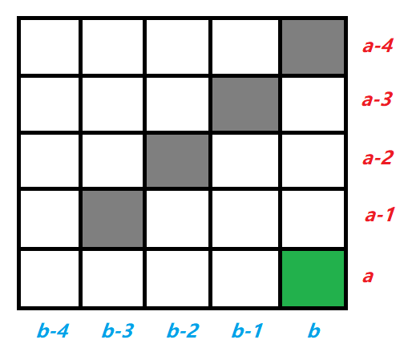
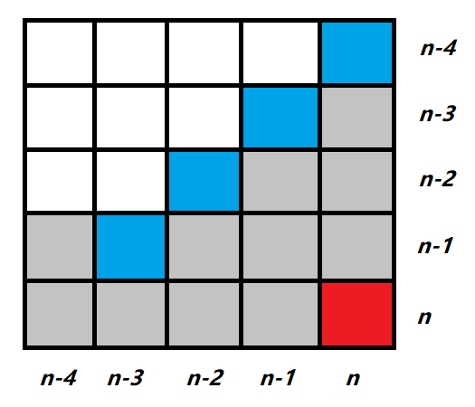

[#0808-soup-servings]
= 808. 分汤

https://leetcode.cn/problems/soup-servings/[LeetCode - 808. 分汤^]

有 **A 和 B 两种类型** 的汤。一开始每种类型的汤有 `n` 毫升。有四种分配操作：

. 提供 `100ml` 的 *汤A* 和 `0ml` 的 *汤B* 。
. 提供 `75ml` 的 *汤A* 和 `25ml` 的 *汤B* 。
. 提供 `50ml` 的 *汤A* 和 `50ml` 的 *汤B* 。
. 提供 `25ml` 的 *汤A* 和 `75ml` 的 *汤B* 。

当我们把汤分配给某人之后，汤就没有了。每个回合，我们将从四种概率同为 `0.25` 的操作中进行分配选择。如果汤的剩余量不足以完成某次操作，我们将尽可能分配。当两种类型的汤都分配完时，停止操作。

**注意**不存在先分配 `100` ml *汤B* 的操作。

需要返回的值： **汤A** 先分配完的概率 +  **汤A和汤B** 同时分配完的概率一半。返回值在正确答案 `10^-5^` 的范围内将被认为是正确的。

*示例 1:*

....
输入: n = 50
输出: 0.62500
解释:如果我们选择前两个操作，A 首先将变为空。
对于第三个操作，A 和 B 会同时变为空。
对于第四个操作，B 首先将变为空。
所以 A 变为空的总概率加上 A 和 B 同时变为空的概率的一半是 0.25 *(1 + 1 + 0.5 + 0)= 0.625。
....

*示例 2:*

....
输入: n = 100
输出: 0.71875
....

*提示:*

* `0 \<= n \<= 10^9^`

== 思路分析

没想到竟然是动态规划！将想得到指定数量的解，那么可以从四种情况来获取：即减去对应数量的值。又因为每次操作都是 `25` 的倍数，所以，可以把原始数字除以 `25` 向上取整。如下图：

[[src-0808]]
[tabs]
====
一刷::
+
--
[{java_src_attr}]
----
include::{sourcedir}/_0808_SoupServings.java[tag=answer]
----
--

// 二刷::
// +
// --
// [{java_src_attr}]
// ----
// include::{sourcedir}/_0808_SoupServings_2.java[tag=answer]
// ----
// --
====

== 参考资料

. https://leetcode.cn/problems/soup-servings/solutions/3745893/gai-lu-dppythonjavacgo-by-endlesscheng-25av/[808. 分汤 - 概率 DP^]
. https://leetcode.cn/problems/soup-servings/solutions/1982919/by-joneli-ts7a/[808. 分汤 - 动态规划(两种方法+优化) & 记忆化dfs 代码清晰 简单易懂^]
. https://leetcode.cn/problems/soup-servings/solutions/1981704/fen-tang-by-leetcode-solution-0yxs/[808. 分汤 - 官方题解^]
