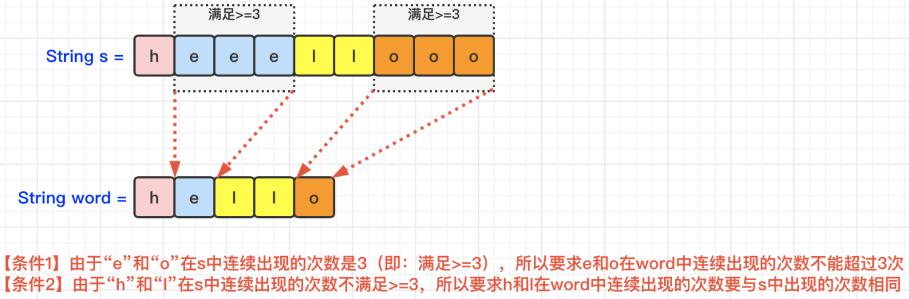

[#0809-expressive-words]
= 809. 情感丰富的文字

https://leetcode.cn/problems/expressive-words/[LeetCode - 809. 情感丰富的文字^]

有时候人们会用重复写一些字母来表示额外的感受，比如 `"hello" -> "heeellooo"`, `"hi" -> "hiii"`。我们将相邻字母都相同的一串字符定义为相同字母组，例如："h", "eee", "ll", "ooo"。

对于一个给定的字符串 `S`，如果另一个单词能够通过将一些字母组扩张从而使其和 `S` 相同，我们将这个单词定义为可扩张的（stretchy）。扩张操作定义如下：选择一个字母组（包含字母 `c`），然后往其中添加相同的字母 `c` 使其长度达到 3 或以上。

例如，以 "hello" 为例，我们可以对字母组 "o" 扩张得到 "hellooo"，但是无法以同样的方法得到 "helloo" 因为字母组 "oo" 长度小于 3。此外，我们可以进行另一种扩张 "ll" -> "lllll" 以获得 "helllllooo"。如果 `s = "helllllooo"`，那么查询词 "hello" 是可扩张的，因为可以对它执行这两种扩张操作使得 `query = "hello" -> "hellooo" -> "helllllooo" = s`。

输入一组查询单词，输出其中可扩张的单词数量。

*示例：*

....
输入：
s = "heeellooo"
words = ["hello", "hi", "helo"]
输出：1
解释：
我们能通过扩张 "hello" 的 "e" 和 "o" 来得到 "heeellooo"。
我们不能通过扩张 "helo" 来得到 "heeellooo" 因为 "ll" 的长度小于 3 。
....

*提示：*

* `+1 <= s.length, words.length <= 100+`
* `+1 <= words[i].length <= 100+`
* s 和所有在 `words` 中的单词都只由小写字母组成。

== 思路分析

依次统计每个单词中每个字母的数量，然后再比较字母和单词数量。

[[src-0809]]
[tabs]
====
一刷::
+
--
[{java_src_attr}]
----
include::{sourcedir}/_0809_ExpressiveWords.java[tag=answer]
----
--

// 二刷::
// +
// --
// [{java_src_attr}]
// ----
// include::{sourcedir}/_0809_ExpressiveWords_2.java[tag=answer]
// ----
// --
====

== 参考资料

. https://leetcode.cn/problems/expressive-words/solutions/1989910/-by-muse-77-fkp6/[809. 情感丰富的文字 - 图解LeetCode^]
. https://leetcode.cn/problems/expressive-words/solutions/1988726/qing-gan-feng-fu-de-wen-zi-by-leetcode-s-vmnm/[809. 情感丰富的文字 - 官方题解^]
