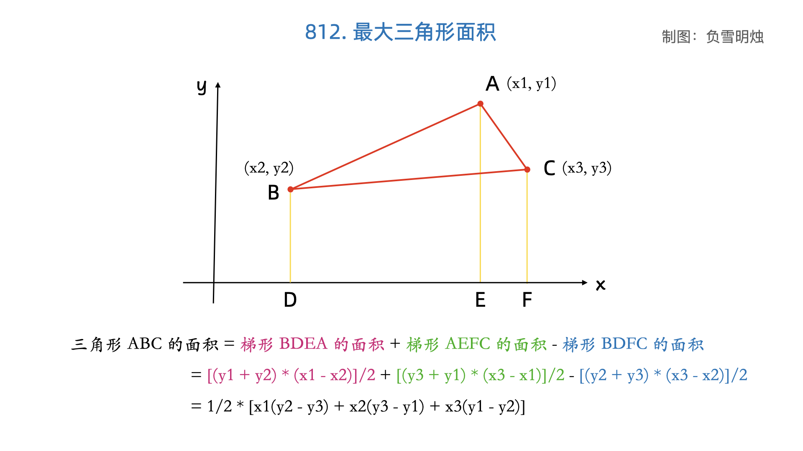

[#0812-largest-triangle-area]
= 812. 最大三角形面积

https://leetcode.cn/problems/largest-triangle-area/[LeetCode - 812. 最大三角形面积^]

给你一个由 *X-Y* 平面上的点组成的数组 `points` ，其中 `points[i] = [x~i~, y~i~]`。从其中取任意三个不同的点组成三角形，返回能组成的最大三角形的面积。与真实值误差在 `10^-5^` 内的答案将会视为正确答案。

*示例 1：*

image::images/0812-01.png[{image_attr}]

....
输入：points = [[0,0],[0,1],[1,0],[0,2],[2,0]]
输出：2.00000
解释：输入中的 5 个点如上图所示，红色的三角形面积最大。
....

*示例 2：*

....
输入：points = [[1,0],[0,0],[0,1]]
输出：0.50000
....

*提示：*

* `3 \<= points.length \<= 50`
* `-50 \<= x~i~, y~i~ \<= 50`
* 给出的所有点 *互不相同*

== 思路分析

平面上任意三点 stem:[A(x_1,y_1)]， stem:[B(x_2,y_2)]， stem:[P(x_3,y_3)]，构成 stem:[\triangle APB]。

[stem]
++++
\overrightarrow{PA} = (x_1-x_3,y_1-y_3)， \overrightarrow{PB} = (x_2-x_3,y_2-y_3)
++++

[stem]
++++
S_{\triangle APB} = \frac{1}{2}|(x_1-x_3)(y_2-y_3)-(x_2-x_3)(y_1-y_3)|
++++

[[src-0812]]
[tabs]
====
一刷::
+
--
[{java_src_attr}]
----
include::{sourcedir}/_0812_LargestTriangleArea.java[tag=answer]
----
--

// 二刷::
// +
// --
// [{java_src_attr}]
// ----
// include::{sourcedir}/_0812_LargestTriangleArea_2.java[tag=answer]
// ----
// --
====

== 参考资料

. https://www.zhihu.com/question/487266436/answer/2268228655[如何在空间直角坐标系中已知三个点坐标求三角形面积和判断形状？^]
. https://leetcode.cn/problems/largest-triangle-area/solutions/1490629/zui-da-san-jiao-xing-mian-ji-by-leetcode-yefh/[812. 最大三角形面积 - 官方题解^]
. https://leetcode.cn/problems/largest-triangle-area/solutions/3793198/liang-chong-fang-fa-mei-ju-tu-bao-xuan-z-1780/[812. 最大三角形面积 - 两种方法：枚举 / 凸包+旋转卡壳^]
. https://leetcode.cn/problems/largest-triangle-area/solutions/1494969/by-fuxuemingzhu-czdh/[812. 最大三角形面积 - 小学生也能看懂的三角形面积公式^]

