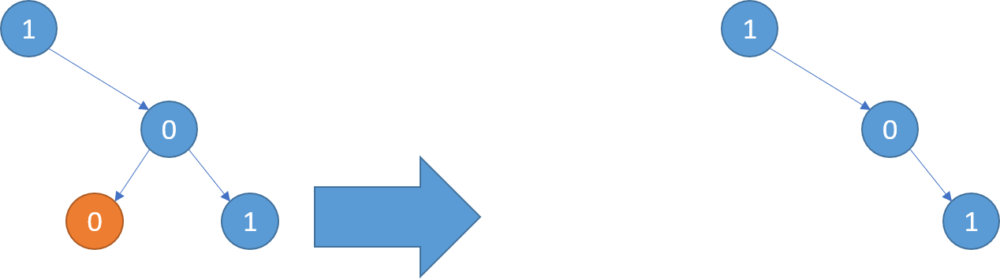
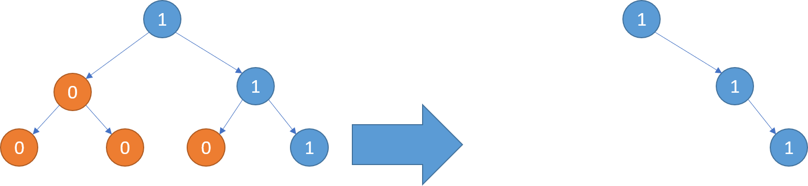
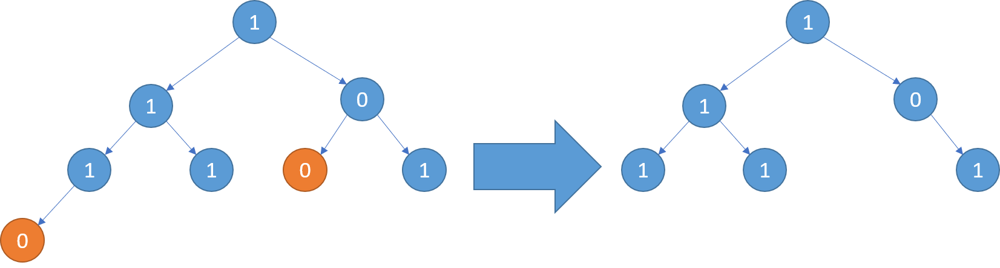

[#0814-binary-tree-pruning]
= 814. 二叉树剪枝

https://leetcode.cn/problems/binary-tree-pruning/[LeetCode - 814. 二叉树剪枝^]

给你二叉树的根结点 `root` ，此外树的每个结点的值要么是 `0` ，要么是 `1`。

返回移除了所有不包含 `1` 的子树的原二叉树。

节点 `node` 的子树为 `node` 本身加上所有 `node` 的后代。

*示例 1：*

....
输入：root = [1,null,0,0,1]
输出：[1,null,0,null,1]
解释：
只有红色节点满足条件“所有不包含 1 的子树”。 右图为返回的答案。
....

*示例 2：*

....
输入：root = [1,0,1,0,0,0,1]
输出：[1,null,1,null,1]
....

*示例 3：*

....
输入：root = [1,1,0,1,1,0,1,0]
输出：[1,1,0,1,1,null,1]
....

*提示：*

* 树中节点的数目在范围 `[1, 200]` 内
* `Node.val` 为 `0` 或 `1`

== 思路分析

简单递归运用题。

[[src-0814]]
[tabs]
====
一刷::
+
--
[{java_src_attr}]
----
include::{sourcedir}/_0814_BinaryTreePruning.java[tag=answer]
----
--

// 二刷::
// +
// --
// [{java_src_attr}]
// ----
// include::{sourcedir}/_0814_BinaryTreePruning_2.java[tag=answer]
// ----
// --
====

== 参考资料

. https://leetcode.cn/problems/binary-tree-pruning/solutions/1683846/er-cha-shu-jian-zhi-by-leetcode-solution-k336/[814. 二叉树剪枝 - 官方题解^]
. https://leetcode.cn/problems/binary-tree-pruning/solutions/1686077/by-ac_oier-7me9/[814. 二叉树剪枝 - 简单递归运用题^]
