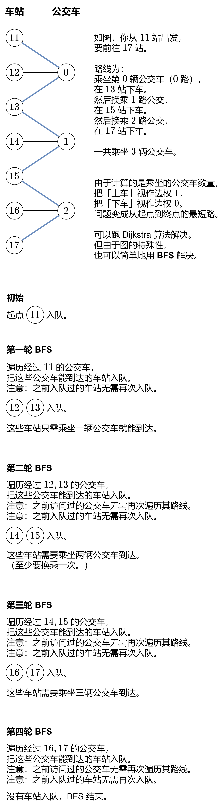

[#0815-bus-routes]
= 815. 公交路线

https://leetcode.cn/problems/bus-routes/[LeetCode - 815. 公交路线^]

给你一个数组 `routes` ，表示一系列公交线路，其中每个 `routes[i]` 表示一条公交线路，第 `i` 辆公交车将会在上面循环行驶。

* 例如，路线 `routes[0] = [1, 5, 7]` 表示第 `0` 辆公交车会一直按序列 `1 -> 5 -> 7 -> 1 -> 5 -> 7 -> 1 -> ...` 这样的车站路线行驶。

现在从 `source` 车站出发（初始时不在公交车上），要前往 `target` 车站。 期间仅可乘坐公交车。

求出 *最少乘坐的公交车数量* 。如果不可能到达终点车站，返回 `-1` 。

*示例 1：*

....
输入：routes = [[1,2,7],[3,6,7]], source = 1, target = 6
输出：2
解释：最优策略是先乘坐第一辆公交车到达车站 7 , 然后换乘第二辆公交车到车站 6 。
....

*示例 2：*

....
输入：routes = [[7,12],[4,5,15],[6],[15,19],[9,12,13]], source = 15, target = 12
输出：-1
....

*提示：*

* `1 \<= routes.length \<= 500`.
* `1 \<= routes[i].length \<= 10^5^`
* `routes[i]` 中的所有值 *互不相同*
* `sum(routes[i].length) \<= 10^5^`
* `0 \<= routes[i][j] < 10^6^`
* `0 \<= source, target < 10^6^`

== 思路分析

[[src-0815]]
[tabs]
====
一刷::
+
--
[{java_src_attr}]
----
include::{sourcedir}/_0815_BusRoutes.java[tag=answer]
----
--

// 二刷::
// +
// --
// [{java_src_attr}]
// ----
// include::{sourcedir}/_0815_BusRoutes_2.java[tag=answer]
// ----
// --
====

== 参考资料

. https://leetcode.cn/problems/bus-routes/solutions/2916806/tu-jie-bfspythonjavacgojsrust-by-endless-t7oc/[815. 公交路线 - 【图解】BFS 线性做法^]
. https://leetcode.cn/problems/bus-routes/solutions/847860/gong-jiao-lu-xian-by-leetcode-solution-yifz/[815. 公交路线 - 官方题解^]
. https://leetcode.cn/problems/bus-routes/solutions/848330/gong-shui-san-xie-yi-ti-shuang-jie-po-su-1roh/[815. 公交路线 - 一题双解：「朴素 BFS」&「双向 BFS（并查集）」^]
