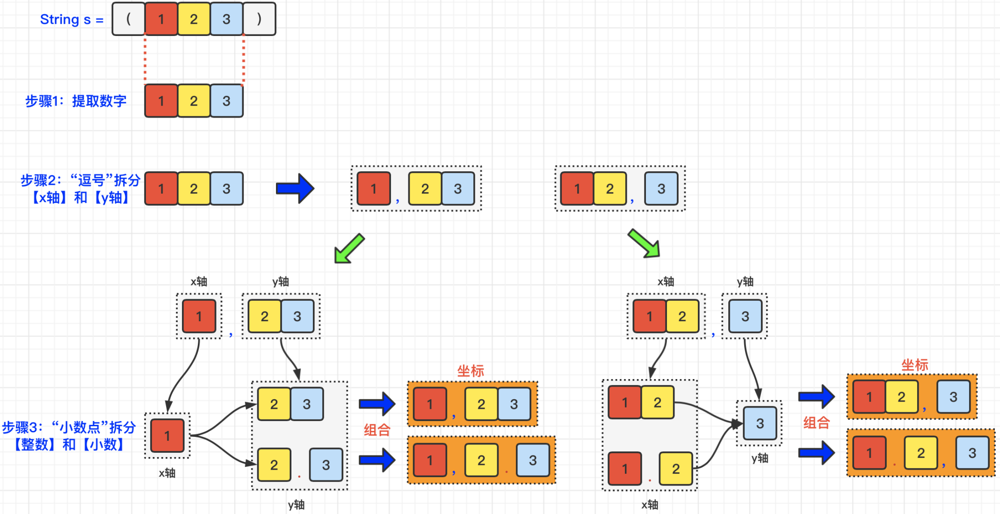

[#0816-ambiguous-coordinates]
= 816. 模糊坐标

https://leetcode.cn/problems/ambiguous-coordinates/[LeetCode - 816. 模糊坐标^]

我们有一些二维坐标，如 `(1, 3)` 或 `(2, 0.5)`，然后我们移除所有逗号，小数点和空格，得到一个字符串`S`。返回所有可能的原始字符串到一个列表中。

原始的坐标表示法不会存在多余的零，所以不会出现类似于"00", "0.0", "0.00", "1.0", "001", "00.01"或一些其他更小的数来表示坐标。此外，一个小数点前至少存在一个数，所以也不会出现“.1”形式的数字。

最后返回的列表可以是任意顺序的。而且注意返回的两个数字中间（逗号之后）都有一个空格。

....
示例 1:
输入: "(123)"
输出: ["(1, 23)", "(12, 3)", "(1.2, 3)", "(1, 2.3)"]
....

....
示例 2:
输入: "(00011)"
输出:  ["(0.001, 1)", "(0, 0.011)"]
解释:
0.0, 00, 0001 或 00.01 是不被允许的。
....

....
示例 3:
输入: "(0123)"
输出: ["(0, 123)", "(0, 12.3)", "(0, 1.23)", "(0.1, 23)", "(0.1, 2.3)", "(0.12, 3)"]
....

....
示例 4:
输入: "(100)"
输出: [(10, 0)]
解释:
1.0 是不被允许的。
....

*提示:*

* `4 \<= S.length \<= 12`.
* `S[0] = (`, `S[S.length - 1] = )`, 且字符串 `S` 中的其他元素都是数字。

== 思路分析

将字符串进行分割，然后给每个分割的字符串添加小数点，要排除非法数字的情况。

[[src-0816]]
[tabs]
====
一刷::
+
--
[{java_src_attr}]
----
include::{sourcedir}/_0816_AmbiguousCoordinates.java[tag=answer]
----
--

// 二刷::
// +
// --
// [{java_src_attr}]
// ----
// include::{sourcedir}/_0816_AmbiguousCoordinates_2.java[tag=answer]
// ----
// --
====

== 参考资料

. https://leetcode.cn/problems/ambiguous-coordinates/solutions/1951931/mo-hu-zuo-biao-by-leetcode-solution-y1yz/[816. 模糊坐标 - 官方题解^]
. https://leetcode.cn/problems/ambiguous-coordinates/solutions/1953793/zhua-wa-mou-si-tu-jie-leetcode-by-muse-7-7y25/[816. 模糊坐标 - 图解LeetCode^]
