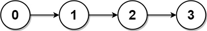
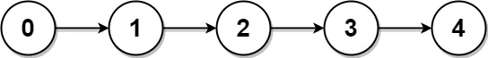
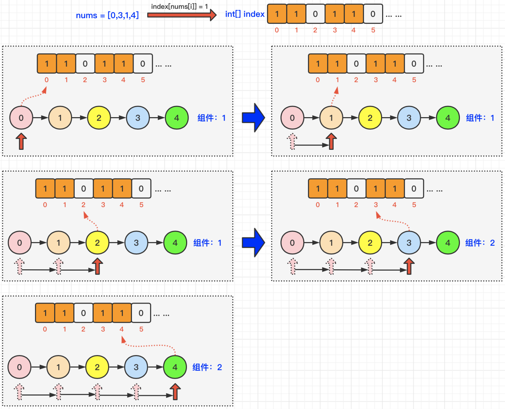

[#0817-linked-list-components]
= 817. 链表组件

https://leetcode.cn/problems/linked-list-components/[LeetCode - 817. 链表组件^]

给定链表头结点 `head`，该链表上的每个结点都有一个 *唯一的整型值*。同时给定列表 `nums`，该列表是上述链表中整型值的一个子集。

返回列表 `nums` 中组件的个数，这里对组件的定义为：链表中一段最长连续结点的值（该值必须在列表 `nums` 中）构成的集合。

*示例 1：*

....
输入: head = [0,1,2,3], nums = [0,1,3]
输出: 2
解释: 链表中,0 和 1 是相连接的，且 nums 中不包含 2，所以 [0, 1] 是 nums 的一个组件，同理 [3] 也是一个组件，故返回 2。
....

*示例 2：*

....
输入: head = [0,1,2,3,4], nums = [0,3,1,4]
输出: 2
解释: 链表中，0 和 1 是相连接的，3 和 4 是相连接的，所以 [0, 1] 和 [3, 4] 是两个组件，故返回 2。
....

*提示：*

* 链表中节点数为`n`
* `1 \<= n \<= 10^4^`
* `0 \<= Node.val < n`
* `Node.val` 中所有值 *不同*
* `1 \<= nums.length \<= n`
* `0 \<= nums[i] < n`
* `nums` 中所有值 *不同*

== 思路分析

在链表中，找到“存在”的“头”，然后将连续内容跳过，继续寻找下一个。不存在的节点，直接跳过去。

[[src-0817]]
[tabs]
====
一刷::
+
--
[{java_src_attr}]
----
include::{sourcedir}/_0817_LinkedListComponents.java[tag=answer]
----
--

// 二刷::
// +
// --
// [{java_src_attr}]
// ----
// include::{sourcedir}/_0817_LinkedListComponents_2.java[tag=answer]
// ----
// --
====

== 参考资料

. https://leetcode.cn/problems/linked-list-components/solutions/1883654/lian-biao-zu-jian-by-leetcode-solution-5f91/[817. 链表组件 - 官方题解^]
. https://leetcode.cn/problems/linked-list-components/solutions/1885886/zhua-wa-mou-si-by-muse-77-1rz4/[817. 链表组件 - 图解LeetCode^]
