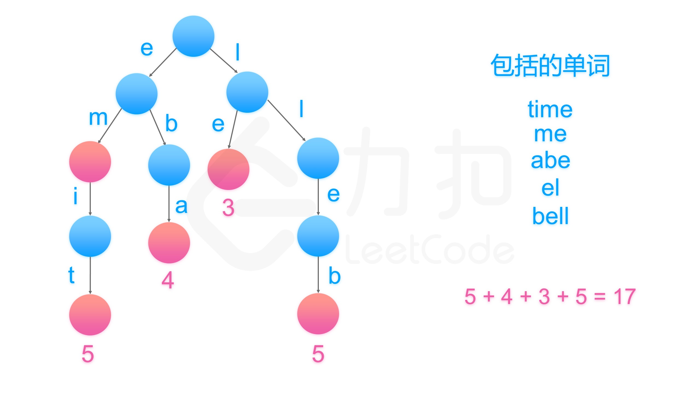

[#0820-short-encoding-of-words]
= 820. 单词的压缩编码

https://leetcode.cn/problems/short-encoding-of-words/[LeetCode - 820. 单词的压缩编码^]

单词数组 `words` 的 *有效编码* 由任意助记字符串 `s` 和下标数组 `indices` 组成，且满足：

* `words.length == indices.length`
* 助记字符串 `s` 以 `#` 字符结尾
* 对于每个下标 `indices[i]` ，`s` 的一个从 `indices[i]` 开始、到下一个 `#` 字符结束（但不包括 `#`）的 *子字符串* 恰好与 `words[i]` 相等

给你一个单词数组 `words` ，返回成功对 `words` 进行编码的最小助记字符串 `s` 的长度 。

*示例 1：*

....
输入：words = ["time", "me", "bell"]
输出：10
解释：一组有效编码为 s = "time#bell#" 和 indices = [0, 2, 5] 。
words[0] = "time" ，s 开始于 indices[0] = 0 到下一个 '#' 结束的子字符串，如加粗部分所示 "time#bell#"
words[1] = "me" ，s 开始于 indices[1] = 2 到下一个 '#' 结束的子字符串，如加粗部分所示 "time#bell#"
words[2] = "bell" ，s 开始于 indices[2] = 5 到下一个 '#' 结束的子字符串，如加粗部分所示 "time#bell#"
....

*示例 2：*

....
输入：words = ["t"]
输出：2
解释：一组有效编码为 s = "t#" 和 indices = [0] 。
....

*提示：*

* `1 \<= words.length \<= 2000`
* `1 \<= words[i].length \<= 7`
* `words[i]` 仅由小写字母组成

== 思路分析

投机取巧的办法：给单词数组按照长度从大到小排列（长单词不可能为短单词的后缀），然后逐个判断已有助记词是否保护单词再决定是否添加。

image::images/0820-10.gif[{image_attr}]

更好的解法是：将单词反转，将单词添加到前缀树中，最后根据前缀树叶子简单对应的长度来计算结果。

[[src-0820]]
[tabs]
====
一刷::
+
--
[{java_src_attr}]
----
include::{sourcedir}/_0820_ShortEncodingOfWords.java[tag=answer]
----
--

// 二刷::
// +
// --
// [{java_src_attr}]
// ----
// include::{sourcedir}/_0820_ShortEncodingOfWords_2.java[tag=answer]
// ----
// --
====

== 参考资料

. https://leetcode.cn/problems/short-encoding-of-words/solutions/173709/dan-ci-de-ya-suo-bian-ma-by-leetcode-solution/[820. 单词的压缩编码 - 官方题解^]
. https://leetcode.cn/problems/short-encoding-of-words/solutions/174404/99-java-trie-tu-xie-gong-lue-bao-jiao-bao-hui-by-s/[820. 单词的压缩编码 - 99% Trie 吐血攻略，包教包会^]
. https://leetcode.cn/problems/short-encoding-of-words/solutions/174362/wu-xu-zi-dian-shu-qing-qing-yi-fan-zhuan-jie-guo-j/[820. 单词的压缩编码 - 无需字典树，轻轻一反转，结果就出来^]
