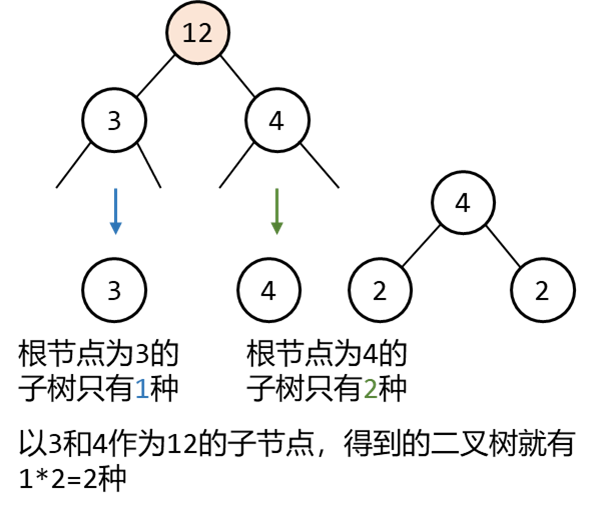
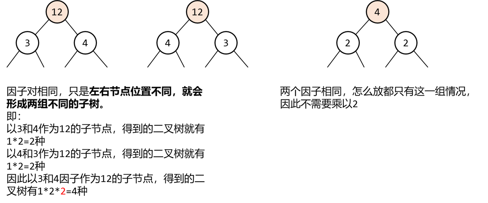
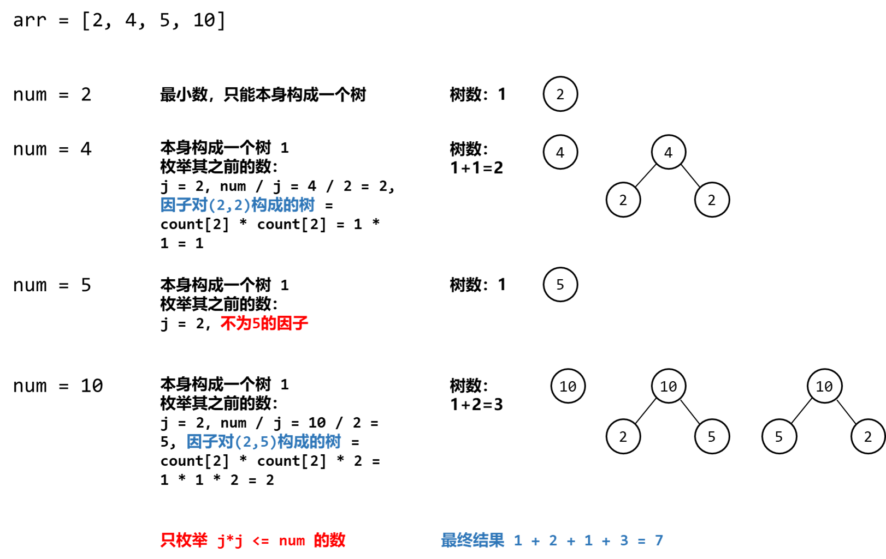

[#0823-binary-trees-with-factors]
= 823. 带因子的二叉树

https://leetcode.cn/problems/binary-trees-with-factors/[LeetCode - 823. 带因子的二叉树^]

给出一个含有不重复整数元素的数组 `arr` ，每个整数 `arr[i]` 均大于 1。

用这些整数来构建二叉树，每个整数可以使用任意次数。其中：每个非叶结点的值应等于它的两个子结点的值的乘积。

满足条件的二叉树一共有多少个？答案可能很大，返回 *对* `10^9^ + 7` *取余* 的结果。

*示例 1:*

....
输入: arr = [2, 4]
输出: 3
解释: 可以得到这些二叉树: [2], [4], [4, 2, 2]
....

*示例 2:*

....
输入: arr = [2, 4, 5, 10]
输出: 7
解释: 可以得到这些二叉树: [2], [4], [5], [10], [4, 2, 2], [10, 2, 5], [10, 5, 2].
....

*提示：*

* `1 \<= arr.length \<= 1000`
* `2 \<= arr[i] \<= 10^9^`
* `arr` 中的所有值 *互不相同*

== 思路分析

斐波那契式的动态规划。子树还有子树，递归看去，就是更小规划的问题。

[[src-0823]]
[tabs]
====
一刷::
+
--
[{java_src_attr}]
----
include::{sourcedir}/_0823_BinaryTreesWithFactors.java[tag=answer]
----
--

// 二刷::
// +
// --
// [{java_src_attr}]
// ----
// include::{sourcedir}/_0823_BinaryTreesWithFactors_2.java[tag=answer]
// ----
// --
====

== 参考资料

. https://leetcode.cn/problems/binary-trees-with-factors/solutions/2416115/cong-ji-yi-hua-sou-suo-dao-di-tui-jiao-n-nbk6/[823. 带因子的二叉树 - 从记忆化搜索到递推，教你一步步思考动态规划！^]
. https://leetcode.cn/problems/binary-trees-with-factors/solutions/2414616/dai-yin-zi-de-er-cha-shu-by-leetcode-sol-0082/[823. 带因子的二叉树 - 官方题解^]
. https://leetcode.cn/problems/binary-trees-with-factors/solutions/2417114/javapython3cpai-xu-dong-tai-gui-hua-tong-yil6/[823. 带因子的二叉树 - 排序+动态规划：统计以每个数值为根的满足条件的二叉树个数【图解】^]
