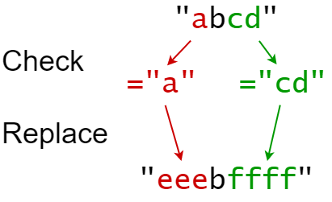
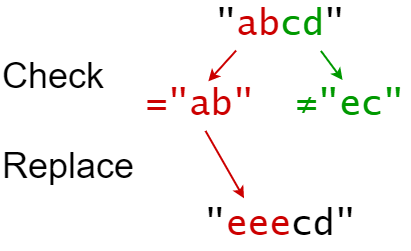

[#0833-find-and-replace-in-string]
= 833. 字符串中的查找与替换

https://leetcode.cn/problems/find-and-replace-in-string/[LeetCode - 833. 字符串中的查找与替换^]

你会得到一个字符串 `s` (索引从 0 开始)，你必须对它执行 `k` 个替换操作。替换操作以三个长度均为 `k` 的并行数组给出：`indices`, `sources`,  `targets`。

要完成第 `i` 个替换操作:

. 检查 *子字符串*  `sources[i]` 是否出现在 *原字符串* `s` 的索引 `indices[i]` 处。
. 如果没有出现， *什么也不做* 。
. 如果出现，则用 `targets[i]` *替换* 该子字符串。

例如，如果 `s = "abcd"` ， `indices[i] = 0`, `sources[i] = "ab"`， `targets[i] = "eee"` ，那么替换的结果将是 `+"+[.underline]#eee#+cd"+` 。

所有替换操作必须 *同时*发生，这意味着替换操作不应该影响彼此的索引。测试用例保证元素间**不会重叠**。

* 例如，一个 `s = "abc"` ，  `indices = [0,1]` ，`sources = ["ab"，"bc"]` 的测试用例将不会生成，因为 `ab` 和
`bc` 替换重叠。

_在对 `s` 执行所有替换操作后返回 *结果字符串* 。_

*子字符串* 是字符串中连续的字符序列。

*示例 1：*

....
输入：s = "abcd", indices = [0,2], sources = ["a","cd"], targets = ["eee","ffff"]
输出："eeebffff"
解释：
"a" 从 s 中的索引 0 开始，所以它被替换为 "eee"。
"cd" 从 s 中的索引 2 开始，所以它被替换为 "ffff"。
....

*示例 2：*

....
输入：s = "abcd", indices = [0,2], sources = ["ab","ec"], targets = ["eee","ffff"]
输出："eeecd"
解释：
"ab" 从 s 中的索引 0 开始，所以它被替换为 "eee"。
"ec" 没有从原始的 S 中的索引 2 开始，所以它没有被替换。
....

*提示：*

* `1 \<= s.length \<= 1000`
* `k == indices.length == sources.length == targets.length`
* `1 \<= k \<= 100`
* `0 \<= indices[i] < s.length`
* `1 \<= sources[i].length, targets[i].length \<= 50`
* `s` 仅由小写英文字母组成
* `sources[i]` 和 `targets[i]` 仅由小写英文字母组成

== 思路分析

对需要替换的数据做排序，利用区间合并的套路，筛选出合格的替换字符串。然后依次做字符串替换。

WARNING: 审题不仔细！题目保证不会重叠，还在瞎处理重叠情况。

[[src-0833]]
[tabs]
====
一刷::
+
--
[{java_src_attr}]
----
include::{sourcedir}/_0833_FindAndReplaceInString.java[tag=answer]
----
--

// 二刷::
// +
// --
// [{java_src_attr}]
// ----
// include::{sourcedir}/_0833_FindAndReplaceInString_2.java[tag=answer]
// ----
// --
====

== 参考资料

. https://leetcode.cn/problems/find-and-replace-in-string/solutions/2388853/xian-xing-zuo-fa-pythonjavacgojs-by-endl-uofo/[833. 字符串中的查找与替换 - 线性做法^]
. https://leetcode.cn/problems/find-and-replace-in-string/solutions/2387388/zi-fu-chuan-zhong-de-cha-zhao-yu-ti-huan-9ns4/[833. 字符串中的查找与替换 - 官方题解^]
