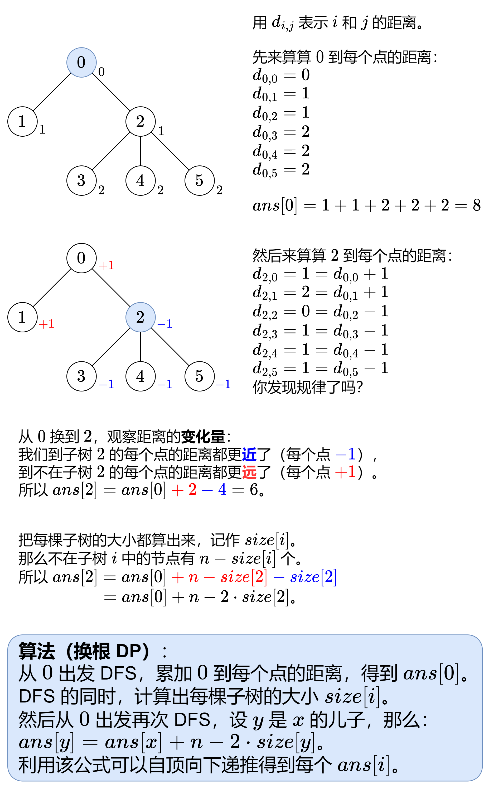

[#0834-sum-of-distances-in-tree]
= 834. 树中距离之和

https://leetcode.cn/problems/sum-of-distances-in-tree/[LeetCode - 834. 树中距离之和^]

给定一个无向、连通的树。树中有 `n` 个标记为 `0...n-1` 的节点以及 `n-1` 条边。

给定整数 `n` 和数组 `edges` ， `edges[i] = [a~i~, b~i~]` 表示树中的节点 `a~i~` 和 `b~i~` 之间有一条边。

返回长度为 `n` 的数组 `answer` ，其中 `answer[i]` 是树中第 `i` 个节点与所有其他节点之间的距离之和。

*示例 1:*

image::images/0834-01.jpg[{image_attr}]

....
输入: n = 6, edges = [[0,1],[0,2],[2,3],[2,4],[2,5]]
输出: [8,12,6,10,10,10]
解释: 树如图所示。
我们可以计算出 dist(0,1) + dist(0,2) + dist(0,3) + dist(0,4) + dist(0,5)
也就是 1 + 1 + 2 + 2 + 2 = 8。 因此，answer[0] = 8，以此类推。
....

*示例 2:*

....
输入: n = 1, edges = []
输出: [0]
....

*示例 3:*

image::images/0834-03.jpg[{image_attr}]

....
输入: n = 2, edges = [[1,0]]
输出: [1,1]
....

*提示:*

* `1 \<= n \<= 3 * 10^4^`
* `edges.length == n - 1`
* `edges[i].length == 2`
* `0 \<= a~i~, b~i~ < n`
* `a~i~ != b~i~`
* 给定的输入保证为有效的树

== 思路分析

每次将图都“转化”成一棵以起点为根的多叉树。对树做深度优先遍历，即可计算所需要的距离之和。可惜会超时！

这道题的最优解是换根 DP：

[[src-0834]]
[tabs]
====
一刷::
+
--
[{java_src_attr}]
----
include::{sourcedir}/_0834_SumOfDistancesInTree.java[tag=answer]
----
--

二刷::
+
--
[{java_src_attr}]
----
include::{sourcedir}/_0834_SumOfDistancesInTree_2.java[tag=answer]
----
--
====

== 参考资料

. https://leetcode.cn/problems/sum-of-distances-in-tree/solutions/2345592/tu-jie-yi-zhang-tu-miao-dong-huan-gen-dp-6bgb/[834. 树中距离之和 - 【图解】一张图秒懂换根 DP！^]
. https://leetcode.cn/problems/sum-of-distances-in-tree/solutions/437330/shou-hua-tu-jie-shu-zhong-ju-chi-zhi-he-shu-xing-d/[834. 树中距离之和 - 「手画图解」834.树中距离之和 | 树形DP | 思路详解^]
. https://leetcode.cn/problems/sum-of-distances-in-tree/solutions/2449965/gong-shui-san-xie-shu-xing-dp-chang-gui-1v7ud/[834. 树中距离之和 - 树形 DP 常规运用题^]
. https://leetcode.cn/problems/sum-of-distances-in-tree/solutions/437205/shu-zhong-ju-chi-zhi-he-by-leetcode-solution/[834. 树中距离之和 - 官方题解^]
