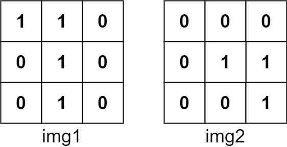
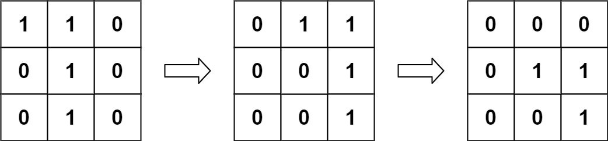
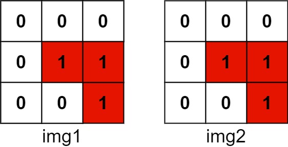

[#0835-image-overlap]
= 835. 图像重叠

https://leetcode.cn/problems/image-overlap/[LeetCode - 835. 图像重叠^]

给你两个图像 `img1` 和 `img2` ，两个图像的大小都是 `n x n`，用大小相同的二进制正方形矩阵表示。二进制矩阵仅由若干 `0` 和若干 `1` 组成。

*转换* 其中一个图像，将所有的 `1` 向左，右，上，或下滑动任何数量的单位；然后把它放在另一个图像的上面。该转换的 *重叠* 是指两个图像 *都* 具有 `1` 的位置的数目。

请注意，转换 *不包括* 向任何方向旋转。越过矩阵边界的 `1` 都将被清除。

最大可能的重叠数量是多少？

*示例 1：*

====
输入：img1 = [[1,1,0],[0,1,0],[0,1,0]], img2 = [[0,0,0],[0,1,1],[0,0,1]]
输出：3
解释：将 img1 向右移动 1 个单位，再向下移动 1 个单位。

两个图像都具有 1 的位置的数目是 3（用红色标识）。

====

*示例 2：*

....
输入：img1 = [[1]], img2 = [[1]]
输出：1
....

*示例 3：*

....
输入：img1 = [[0]], img2 = [[0]]
输出：0
....

*提示：*

* `n == img1.length == img1[i].length`
* `n == img2.length == img2[i].length`
* `1 \<= n \<= 30`
* `img1[i][j]` 为 `0` 或 `1`
* `img2[i][j]` 为 `0` 或 `1`

== 思路分析

刚开始以为是每个点任意移动，后来发现需要整体移动！

奇怪的是，使用 `Map.entry(x, y)` 竟然会超时！使用 `Point` 竟然可以通过！

[[src-0835]]
[tabs]
====
一刷::
+
--
[{java_src_attr}]
----
include::{sourcedir}/_0835_ImageOverlap.java[tag=answer]
----
--

// 二刷::
// +
// --
// [{java_src_attr}]
// ----
// include::{sourcedir}/_0835_ImageOverlap_2.java[tag=answer]
// ----
// --
====

== 参考资料

. https://leetcode.cn/problems/image-overlap/solutions/13029/javajie-fa-chao-ji-xiang-xi-de-jie-xi-by-coder_hez/[835. 图像重叠 - java解法，超级详细的解析^]
. https://leetcode.cn/problems/image-overlap/solutions/527350/ni-ke-neng-wu-fa-xiang-xiang-de-on2lognd-gc5j/[835. 图像重叠 - 你可能无法想象的O(n^2logn)的算法^]
. https://leetcode.cn/problems/image-overlap/solutions/22529/tu-xiang-zhong-die-by-leetcode/[835. 图像重叠 - 官方题解^]
