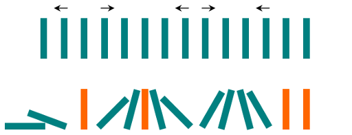

[#0838-push-dominoes]
= 838. 推多米诺

https://leetcode.cn/problems/push-dominoes/[LeetCode - 838. 推多米诺^]

`n` 张多米诺骨牌排成一行，将每张多米诺骨牌垂直竖立。在开始时，同时把一些多米诺骨牌向左或向右推。

每过一秒，倒向左边的多米诺骨牌会推动其左侧相邻的多米诺骨牌。同样地，倒向右边的多米诺骨牌也会推动竖立在其右侧的相邻多米诺骨牌。

如果一张垂直竖立的多米诺骨牌的两侧同时有多米诺骨牌倒下时，由于受力平衡，该骨牌仍然保持不变。

就这个问题而言，我们会认为一张正在倒下的多米诺骨牌不会对其它正在倒下或已经倒下的多米诺骨牌施加额外的力。

给你一个字符串 `dominoes` 表示这一行多米诺骨牌的初始状态，其中：

* `dominoes[i] = L`，表示第 `i` 张多米诺骨牌被推向左侧，
* `dominoes[i] = R`，表示第 `i` 张多米诺骨牌被推向右侧，
* `dominoes[i] = .`，表示没有推动第 `i` 张多米诺骨牌。

返回表示最终状态的字符串。

*示例 1：*

....
输入：dominoes = "RR.L"
输出："RR.L"
解释：第一张多米诺骨牌没有给第二张施加额外的力。
....

*示例 2：*

....
输入：dominoes = ".L.R...LR..L.."
输出："LL.RR.LLRRLL.."
....

*提示：*

* `n == dominoes.length`
* `1 \<= n \<= 10^5^`
* `dominoes[i]` 为 `L`、`R` 或 `.`

== 思路分析

最初想的也是分类处理，过程向复杂了。

直接分成如下集中，再加上“哨兵”，处理起来就会很简单：

. `L..R` 这种两边倒，中间不受影响，无需处理。
. `L..L` 直接全部填 `L` 即可。
. `R..R` 直接全部填 `R` 即可。
. `R..L` 这种使用双指针从两端向中间夹逼即可。

在遍历过程中，直接处理，比最初设想的，把区间坐标成对保存下列，方便很多。

[[src-0838]]
[tabs]
====
一刷::
+
--
[{java_src_attr}]
----
include::{sourcedir}/_0838_PushDominoes.java[tag=answer]
----
--

// 二刷::
// +
// --
// [{java_src_attr}]
// ----
// include::{sourcedir}/_0838_PushDominoes_2.java[tag=answer]
// ----
// --
====

== 参考资料

. https://leetcode.cn/problems/push-dominoes/solutions/3667176/fen-lei-tao-lun-jian-ji-xie-fa-pythonjav-bztd/[838. 推多米诺 - 分类讨论，简洁写法^]
. https://leetcode.cn/problems/push-dominoes/solutions/1280598/fu-xue-ming-zhu-miao-dong-xi-lie-xiang-x-xkts/[838. 推多米诺 - 秒懂系列：详细思路，清晰图解^]
. https://leetcode.cn/problems/push-dominoes/solutions/1280517/gong-shui-san-xie-yi-ti-shuang-jie-bfs-y-z52w/[838. 推多米诺 - 一题双解 :「BFS」&「预处理 + 双指针」^]
. https://leetcode.cn/problems/push-dominoes/solutions/1278202/tui-duo-mi-nuo-by-leetcode-solution-dwgm/[838. 推多米诺 - 官方题解^]
