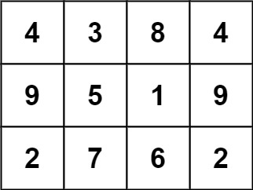
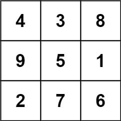
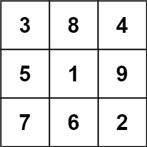

[#0840-magic-squares-in-grid]
= 840. 矩阵中的幻方

https://leetcode.cn/problems/magic-squares-in-grid/[LeetCode - 840. 矩阵中的幻方^]

`3 x 3` 的幻方是一个填充有 *从 `1` 到 `9` * 的不同数字的 `3 x 3` 矩阵，其中每行，每列以及两条对角线上的各数之和都相等。

给定一个由整数组成的`row x col` 的 `grid`，其中有多少个 `3 × 3` 的 “幻方” 子矩阵？

注意：虽然幻方只能包含 1 到 9 的数字，但 `grid` 可以包含最多15的数字。

*示例 1：*

====
输入: grid = [[4,3,8,4],[9,5,1,9],[2,7,6,2]
输出: 1
解释:
下面的子矩阵是一个 3 x 3 的幻方：

而这一个不是：

总的来说，在本示例所给定的矩阵中只有一个 3 x 3 的幻方子矩阵。
====

*示例 2:*

....
输入: grid = [[8]]
输出: 0
....

*提示:*

* `row == grid.length`
* `col == grid[i].length`
* `1 \<= row, col \<= 10`
* `0 \<= grid[i][j] \<= 15`

== 思路分析

[[src-0840]]
[tabs]
====
一刷::
+
--
[{java_src_attr}]
----
include::{sourcedir}/_0840_MagicSquaresInGrid.java[tag=answer]
----
--

// 二刷::
// +
// --
// [{java_src_attr}]
// ----
// include::{sourcedir}/_0840_MagicSquaresInGrid_2.java[tag=answer]
// ----
// --
====

== 参考资料

. https://leetcode.cn/problems/magic-squares-in-grid/solutions/3867033/wu-xu-ji-suan-di-san-xing-lie-de-he-yi-j-djue/[840. 矩阵中的幻方 - 无需计算第三行列的和，以及对角线的和，数学证明^]
. https://leetcode.cn/problems/magic-squares-in-grid/solutions/107797/ju-zhen-zhong-de-huan-fang-by-leetcode-2/[840. 矩阵中的幻方 - 官方题解^]
. https://leetcode.cn/problems/magic-squares-in-grid/solutions/3869061/shuang-jie-shu-xue-fang-fa-jia-su-yu-chu-5uxa/[840. 矩阵中的幻方 - 【双解】数学方法加速 & 预处理优化至 100%，附加证明^]
