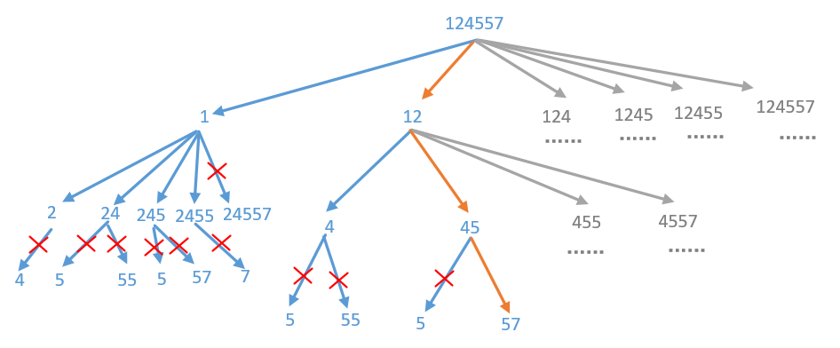

[#0842-split-array-into-fibonacci-sequence]
= 842. 将数组拆分成斐波那契序列

https://leetcode.cn/problems/split-array-into-fibonacci-sequence/[LeetCode - 842. 将数组拆分成斐波那契序列^]

给定一个数字字符串 `num`，比如 `123456579`，我们可以将它分成「斐波那契式」的序列 `[123, 456, 579]`。

形式上，**斐波那契式**序列是一个非负整数列表 `f`，且满足：

* `0 \<= f[i] < 2^31^` ，（也就是说，每个整数都符合 *32 位* 有符号整数类型）
* `f.length >= 3`
* 对于所有的 `0 \<= i < f.length - 2`，都有 `f[i] + f[i + 1] = f[i + 2]`

另外，请注意，将字符串拆分成小块时，每个块的数字一定不要以零开头，除非这个块是数字 `0` 本身。

返回从 `num` 拆分出来的任意一组斐波那契式的序列块，如果不能拆分则返回 `[]`。

*示例 1：*

....
输入：num = "1101111"
输出：[11,0,11,11]
解释：输出 [110,1,111] 也可以。
....

*示例 2：*

....
输入: num = "112358130"
输出: []
解释: 无法拆分。
....

*示例 3：*

....
输入："0123"
输出：[]
解释：每个块的数字不能以零开头，因此 "01"，"2"，"3" 不是有效答案。
....

*提示：*

* `1 \<= num.length \<= 200`
* `num` 中只含有数字

== 思路分析

回溯+剪枝：将字符串分割成数字，逐个检查是否可以组成斐波那契数列，不符合要求就回溯。

[[src-0842]]
[tabs]
====
一刷::
+
--
[{java_src_attr}]
----
include::{sourcedir}/_0842_SplitArrayIntoFibonacciSequence.java[tag=answer]
----
--

// 二刷::
// +
// --
// [{java_src_attr}]
// ----
// include::{sourcedir}/_0842_SplitArrayIntoFibonacciSequence_2.java[tag=answer]
// ----
// --
====

== 参考资料

. https://leetcode.cn/problems/split-array-into-fibonacci-sequence/solutions/513164/jiang-shu-zu-chai-fen-cheng-fei-bo-na-qi-ts6c/[842. 将数组拆分成斐波那契序列 - 官方题解^]
. https://leetcode.cn/problems/split-array-into-fibonacci-sequence/solutions/513430/javahui-su-suan-fa-tu-wen-xiang-jie-ji-b-vg5z/[842. 将数组拆分成斐波那契序列 - java回溯算法图文详解，击败了100%的用户^]
. https://leetcode.cn/problems/split-array-into-fibonacci-sequence/solutions/513567/di-gui-15xing-dai-ma-chao-100-by-mantouf-jssb/[842. 将数组拆分成斐波那契序列 - 递归 + 空间优化 + 时间优化^]
