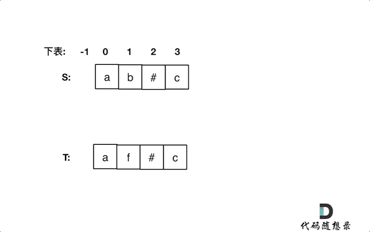

[#0844-backspace-string-compare]
= 844. 比较含退格的字符串

https://leetcode.cn/problems/backspace-string-compare/[LeetCode - 844. 比较含退格的字符串^]

给定 `s` 和 `t` 两个字符串，当它们分别被输入到空白的文本编辑器后，如果两者相等，返回 `true`。`#` 代表退格字符。

**注意：**如果对空文本输入退格字符，文本继续为空。

*示例 1：*

....
输入：s = "ab#c", t = "ad#c"
输出：true
解释：s 和 t 都会变成 "ac"。
....

*示例 2：*

....
输入：s = "ab##", t = "c#d#"
输出：true
解释：s 和 t 都会变成 ""。
....

*示例 3：*

....
输入：s = "a#c", t = "b"
输出：false
解释：s 会变成 "c"，但 t 仍然是 "b"。
....

*提示：*

* `1 \<= s.length, t.length \<= 200`
* `s` 和 `t` 只含有小写字母以及字符 `#`

*进阶：*

* 你可以用 stem:[O(n)] 的时间复杂度和 stem:[O(1)] 的空间复杂度解决该问题吗？

== 思路分析

如果不想占用额外的空间，可以从后向前比较：如果双方都是字母，则直接比较；否则将不是字母的下标向前推进到字母或者结束为止。

[[src-0844]]
[tabs]
====
一刷::
+
--
[{java_src_attr}]
----
include::{sourcedir}/_0844_BackspaceStringCompare.java[tag=answer]
----
--

// 二刷::
// +
// --
// [{java_src_attr}]
// ----
// include::{sourcedir}/_0844_BackspaceStringCompare_2.java[tag=answer]
// ----
// --
====

== 参考资料

. https://leetcode.cn/problems/backspace-string-compare/solutions/451606/bi-jiao-han-tui-ge-de-zi-fu-chuan-by-leetcode-solu/[844. 比较含退格的字符串 - 官方题解^]
. https://leetcode.cn/problems/backspace-string-compare/solutions/683776/shuang-zhi-zhen-bi-jiao-han-tui-ge-de-zi-8fn8/[844. 比较含退格的字符串 - 【双指针】比较含退格的字符串^]
. https://leetcode.cn/problems/backspace-string-compare/solutions/451967/844zhan-mo-ni-yu-kong-jian-geng-you-de-shuang-zhi-/[844. 比较含退格的字符串 - 【栈模拟】与【空间更优的双指针】详解^]
