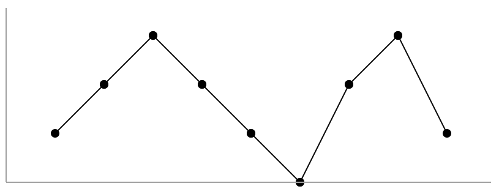

[#0845-longest-mountain-in-array]
= 845. 数组中的最长山脉

https://leetcode.cn/problems/longest-mountain-in-array/[LeetCode - 845. 数组中的最长山脉^]

把符合下列属性的数组 `arr` 称为 *山脉数组* ：

* `arr.length >= 3`
* 存在下标 `i`（`0 < i < arr.length - 1`），满足
** `arr[0] < arr[1] < ... < arr[i - 1] < arr[i]`
** `arr[i] > arr[i + 1] > ... > arr[arr.length - 1]`

给出一个整数数组 `arr`，返回最长山脉子数组的长度。如果不存在山脉子数组，返回 `0` 。

*示例 1：*

....
输入：arr = [2,1,4,7,3,2,5]
输出：5
解释：最长的山脉子数组是 [1,4,7,3,2]，长度为 5。
....

*示例 2：*

....
输入：arr = [2,2,2]
输出：0
解释：不存在山脉子数组。
....

*提示：*

* `1 \<= arr.length \<= 10^4^`
* `0 \<= arr[i] \<= 10^4^`

*进阶：*

* 你可以仅用一趟扫描解决此问题吗？
* 你可以用 stem:[O(1)] 空间解决此问题吗？

== 思路分析

从前向后遍历，统计递增长度，拐点后，统计递降长度。如果遇到相等或者递降拐点成递增，则从头开始。

TIP: 官方题解中，分别从前和从后统计递增，最后再遍历求和的思路也很好。

[[src-0845]]
[tabs]
====
一刷::
+
--
[{java_src_attr}]
----
include::{sourcedir}/_0845_LongestMountainInArray.java[tag=answer]
----
--

// 二刷::
// +
// --
// [{java_src_attr}]
// ----
// include::{sourcedir}/_0845_LongestMountainInArray_2.java[tag=answer]
// ----
// --
====

== 参考资料

. https://leetcode.cn/problems/longest-mountain-in-array/solutions/459406/shu-zu-zhong-de-zui-chang-shan-mai-by-leetcode-sol/[845. 数组中的最长山脉 - 官方题解^]
. https://leetcode.cn/problems/longest-mountain-in-array/solutions/3804958/ling-shen-fen-zu-xun-huan-mo-ban-ti-by-e-phzz/[845. 数组中的最长山脉 - 灵神分组循环模板题^]
