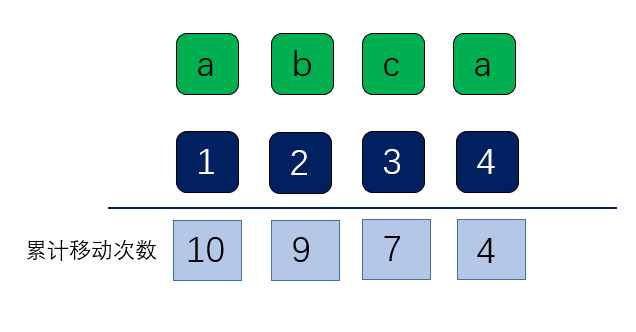

[#0848-shifting-letters]
= 848. 字母移位

https://leetcode.cn/problems/shifting-letters/[LeetCode - 848. 字母移位^]

有一个由小写字母组成的字符串 `s`，和一个长度相同的整数数组 `shifts`。

我们将字母表中的下一个字母称为原字母的 _移位_ `shift()` （由于字母表是环绕的， `z` 将会变成 `a`）。

* 例如，`shift('a') = 'b'`,`shift('t') = 'u'`, 以及 `shift('z') = 'a'`。

对于每个 `shifts[i] = x` ， 我们会将 `s` 中的前 `i + 1` 个字母移位 `x` 次。

返回 _将所有这些移位都应用到 `s` 后最终得到的字符串_ 。

*示例 1：*

....
输入：s = "abc", shifts = [3,5,9]
输出："rpl"
解释：
我们以 "abc" 开始。
将 S 中的第 1 个字母移位 3 次后，我们得到 "dbc"。
再将 S 中的前 2 个字母移位 5 次后，我们得到 "igc"。
最后将 S 中的这 3 个字母移位 9 次后，我们得到答案 "rpl"。
....

*示例 2:*

....
输入: s = "aaa", shifts = [1,2,3]
输出: "gfd"
....

*提示:*

* `1 \<= s.length \<= 10^5^`
* `s` 由小写英文字母组成
* `shifts.length == s.length`
* `0 \<= shifts[i] \<= 10^9^`

== 思路分析

前缀和的变种：后缀和，从后向前，累计计算要移位的次数，然后对字母进行移位。这样，每个字母计算一次移位即可。

[[src-0848]]
[tabs]
====
一刷::
+
--
[{java_src_attr}]
----
include::{sourcedir}/_0848_ShiftingLetters.java[tag=answer]
----
--

// 二刷::
// +
// --
// [{java_src_attr}]
// ----
// include::{sourcedir}/_0848_ShiftingLetters_2.java[tag=answer]
// ----
// --
====

== 参考资料

. https://leetcode.cn/problems/shifting-letters/solutions/49382/zi-mu-yi-wei-by-leetcode/[848. 字母移位 - 官方题解^]
. https://leetcode.cn/problems/shifting-letters/solutions/1109414/848-zi-mu-yi-wei-by-ac_wllysc-ztyv/[848. 字母移位 - 前缀和^]
