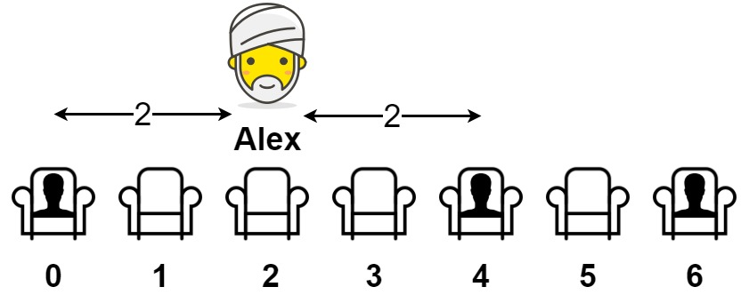

[#0849-maximize-distance-to-closest-person]
= 849. 到最近的人的最大距离

https://leetcode.cn/problems/maximize-distance-to-closest-person/[LeetCode - 849. 到最近的人的最大距离^]

给你一个数组 `seats` 表示一排座位，其中 `seats[i] = 1` 代表有人坐在第 `i` 个座位上，`seats[i] = 0` 代表座位 `i` 上是空的（*下标从 0 开始*）。

至少有一个空座位，且至少有一人已经坐在座位上。

亚历克斯希望坐在一个能够使他与离他最近的人之间的距离达到最大化的座位上。

返回他到离他最近的人的最大距离。

*示例 1：*

....
输入：seats = [1,0,0,0,1,0,1]
输出：2
解释：
如果亚历克斯坐在第二个空位（seats[2]）上，他到离他最近的人的距离为 2 。
如果亚历克斯坐在其它任何一个空位上，他到离他最近的人的距离为 1 。
因此，他到离他最近的人的最大距离是 2 。
....

*示例 2：*

....
输入：seats = [1,0,0,0]
输出：3
解释：
如果亚历克斯坐在最后一个座位上，他离最近的人有 3 个座位远。
这是可能的最大距离，所以答案是 3 。
....

*示例 3：*

....
输入：seats = [0,1]
输出：1
....

*提示：*

* `2 \<= seats.length \<= 2 * 10^4^`
* `seats[i]` 为 `0` 或 `1`
* 至少有一个 *空座位*
* 至少有一个 *座位上有人*

== 思路分析

我的思路：从两边算各自距离有人座位的距离，再求最小值。

更优越的解法是：一次遍历，使用双指针记录上一个有人座位的位置和当前有人座位位置距离除以 `2`。另外，考虑一下距离两端的情况即可。

[[src-0849]]
[tabs]
====
一刷::
+
--
[{java_src_attr}]
----
include::{sourcedir}/_0849_MaximizeDistanceToClosestPerson.java[tag=answer]
----
--

// 二刷::
// +
// --
// [{java_src_attr}]
// ----
// include::{sourcedir}/_0849_MaximizeDistanceToClosestPerson_2.java[tag=answer]
// ----
// --
====

== 参考资料

. https://leetcode.cn/problems/maximize-distance-to-closest-person/solutions/2393766/dao-zui-jin-de-ren-de-zui-da-ju-chi-by-l-zboe/[849. 到最近的人的最大距离 - 官方题解^] -- 官方题解是一坨💩，还不如 https://leetcode.cn/problems/maximize-distance-to-closest-person/solutions/2393766/dao-zui-jin-de-ren-de-zui-da-ju-chi-by-l-zboe/comments/2103486/[Java 一次遍历] 好理解
. https://leetcode.cn/problems/maximize-distance-to-closest-person/solutions/2399151/letmefly-849dao-zui-jin-de-ren-de-zui-da-dnw3/[849. 到最近的人的最大距离 - 一次遍历^]
