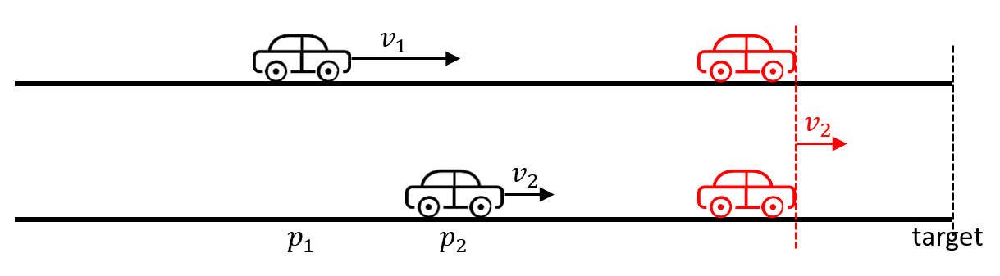
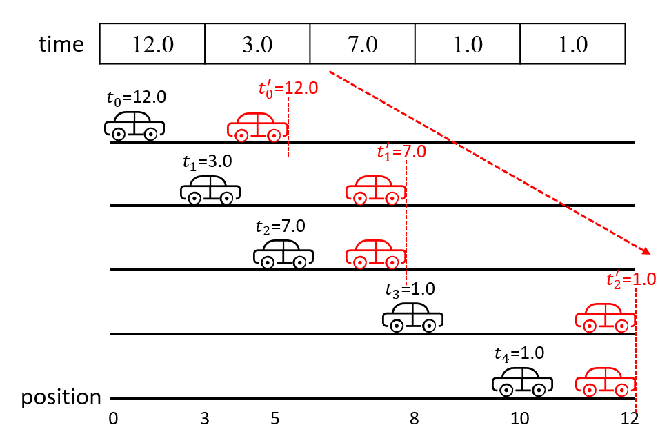

[#0853-car-fleet]
= 853. 车队

https://leetcode.cn/problems/car-fleet/[LeetCode - 853. 车队^]

在一条单行道上，有 `n` 辆车开往同一目的地。目的地是几英里以外的 `target` 。

给定两个整数数组 `position` 和 `speed` ，长度都是 `n`，其中 `position[i]` 是第 `i` 辆车的位置， `speed[i]` 是第 `i` 辆车的速度(单位是英里/小时)。

一辆车永远不会超过前面的另一辆车，但它可以追上去，并以较慢车的速度在另一辆车旁边行驶。

*车队* 是指并排行驶的一辆或几辆汽车。车队的速度是车队中 *最慢* 的车的速度。

即便一辆车在 `target` 才赶上了一个车队，它们仍然会被视作是同一个车队。

返回到达目的地的车队数量。

*示例 1：*

[.example-io]#**输入：**target = 12, position = [10,8,0,5,3], speed =
[2,4,1,1,3]#

[.example-io]#**输出：**3#

*解释：*

* 从 10（速度为 2）和 8（速度为 4）开始的车会组成一个车队，它们在 12  相遇。车队在 `target` 形成。
* 从 0（速度为 1）开始的车不会追上其它任何车，所以它自己是一个车队。
* 从 5（速度为 1） 和 3（速度为 3）开始的车组成一个车队，在 6 相遇。车队以速度 1 移动直到它到达 `target`。

*示例 2：*

**输入：**target = 10, position = [3], speed
= [3]

**输出：**1

*解释：*

只有一辆车，因此只有一个车队。

*示例 3：*

**输入：**target = 100, position = [0,2,4], speed = [4,2,1]

**输出：**1

*解释：*

* 从 0（速度为 4） 和 2（速度为 2）开始的车组成一个车队，在 4 相遇。从 4 开始的车（速度为 1）移动到了 5。
* 然后，在 4（速度为 2）的车队和在 5（速度为 1）的车成为一个车队，在 6 相遇。车队以速度 1 移动直到它到达 `target`。

*提示：*

* `n == position.length == speed.length`
* `1 \<= n \<= 10^5^`
* `0 < target \<= 10^6^`
* `0 \<= position[i] < target`
* `position` 中每个值都 *不同*
* `0 < speed[i] \<= 10^6^`

== 思路分析

将车按照位置排序，然后从后向前计算汽车的耗时，当后一辆车的耗时大于前一辆车的耗时，就可以追上前车，则就可以组成一个车队。追不上，则无法组成车队。

TIP: 从左向右计算，左边的快车会被右边的慢车挡住路，所以从右向左计算更简单。

看题解，单调栈也是一个解法：

[[src-0853]]
[tabs]
====
一刷::
+
--
[{java_src_attr}]
----
include::{sourcedir}/_0853_CarFleet.java[tag=answer]
----
--

// 二刷::
// +
// --
// [{java_src_attr}]
// ----
// include::{sourcedir}/_0853_CarFleet_2.java[tag=answer]
// ----
// --
====

== 参考资料

. https://leetcode.cn/problems/car-fleet/solutions/20104/che-dui-by-leetcode/[853. 车队 - 官方题解^]
. https://leetcode.cn/problems/car-fleet/solutions/3757845/dan-diao-zhan-cong-zhui-ji-wen-ti-dao-me-393t/[853. 车队 - 单调栈|从追及问题到“每日温度”^]
