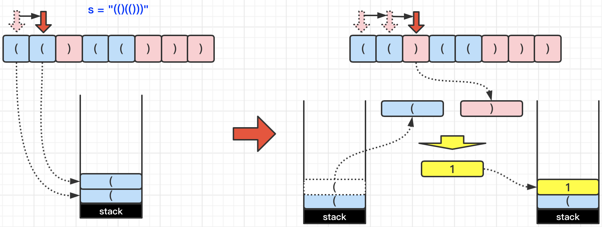
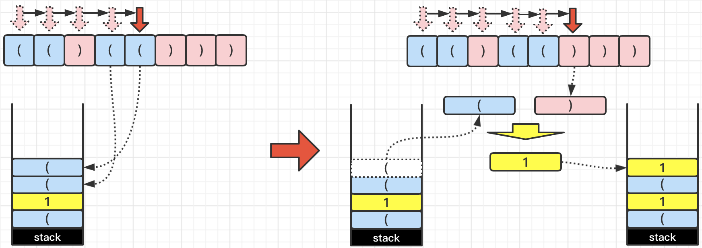
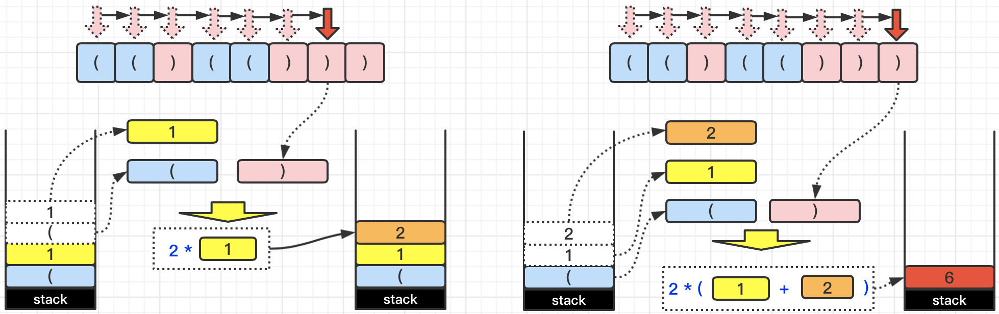

[#0856-score-of-parentheses]
= 856. 括号的分数

https://leetcode.cn/problems/score-of-parentheses/[LeetCode - 856. 括号的分数^]

给定一个平衡括号字符串 `S`，按下述规则计算该字符串的分数：

* `()` 得 1 分。
* `AB` 得 `A + B` 分，其中 A 和 B 是平衡括号字符串。
* `(A)` 得 `2 * A` 分，其中 A 是平衡括号字符串。

*示例 1：*

....
输入： "()"
输出： 1
....

*示例 2：*

....
输入： "(())"
输出： 2
....

*示例 3：*

....
输入： "()()"
输出： 2
....

*示例 4：*

....
输入： "(()(()))"
输出： 6
....

*提示：*

. `S` 是平衡括号字符串，且只含有 `(` 和 `)` 。
. `2 \<= S.length \<= 50`

== 思路分析

最简单直接的解法是：栈。

[[src-0856]]
[tabs]
====
一刷::
+
--
[{java_src_attr}]
----
include::{sourcedir}/_0856_ScoreOfParentheses.java[tag=answer]
----
--

// 二刷::
// +
// --
// [{java_src_attr}]
// ----
// include::{sourcedir}/_0856_ScoreOfParentheses_2.java[tag=answer]
// ----
// --
====

== 参考资料

. https://leetcode.cn/problems/score-of-parentheses/solutions/1876173/gua-hao-de-fen-shu-by-leetcode-solution-we6b/[856. 括号的分数 - 官方题解^]
. https://leetcode.cn/problems/score-of-parentheses/solutions/1878748/zhua-wa-mou-si-by-muse-77-hy72/[856. 括号的分数 - 图解LeetCode^]
