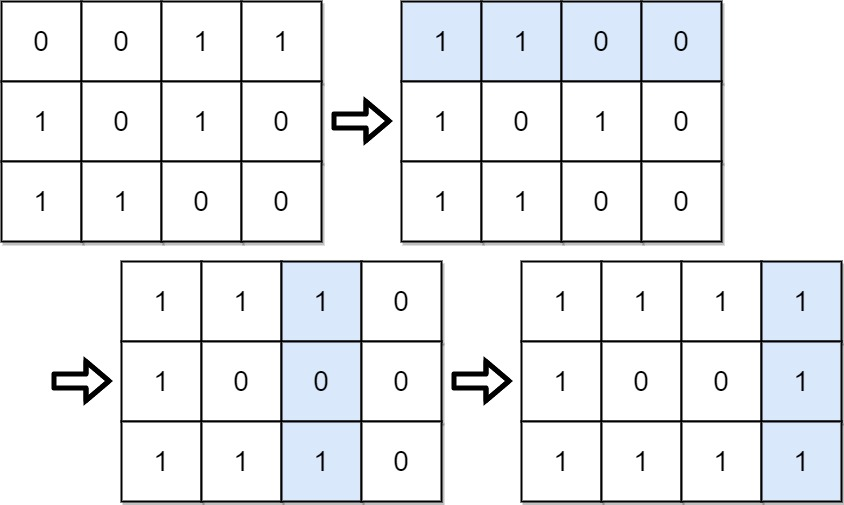

[#0861-score-after-flipping-matrix]
= 861. 翻转矩阵后的得分

https://leetcode.cn/problems/score-after-flipping-matrix/[LeetCode - 861. 翻转矩阵后的得分^]

给你一个大小为 `m x n` 的二元矩阵 `grid` ，矩阵中每个元素的值为 `0` 或 `1`。

一次 *移动* 是指选择任一行或列，并转换该行或列中的每一个值：将所有 `0` 都更改为 `1`，将所有 `1` 都更改为 `0`。

在做出任意次数的移动后，将该矩阵的每一行都按照二进制数来解释，矩阵的 *得分* 就是这些数字的总和。

在执行任意次 *移动* 后（含 0 次），返回可能的最高分数。

*示例 1：*

....
输入：grid = [[0,0,1,1],[1,0,1,0],[1,1,0,0]]
输出：39
解释：0b1111 + 0b1001 + 0b1111 = 15 + 9 + 15 = 39
....

*示例 2：*

....
输入：grid = [[0]]
输出：1
....

*提示：*

* `m == grid.length`
* `n == grid[i].length`
* `1 \<= m, n \<= 20+`
* `grid[i][j]` 为 `0` 或 `1`

== 思路分析

[[src-0861]]
[tabs]
====
一刷::
+
--
[{java_src_attr}]
----
include::{sourcedir}/_0861_ScoreAfterFlippingMatrix.java[tag=answer]
----
--

// 二刷::
// +
// --
// [{java_src_attr}]
// ----
// include::{sourcedir}/_0861_ScoreAfterFlippingMatrix_2.java[tag=answer]
// ----
// --
====

== 参考资料

. https://leetcode.cn/problems/score-after-flipping-matrix/solutions/512802/jiu-ying-suan-tong-su-yi-dong-mei-xiang-fgt9j/[861. 翻转矩阵后的得分 - 就硬算，通俗易懂，一开始没想到位操作^]
. https://leetcode.cn/problems/score-after-flipping-matrix/solutions/512323/fan-zhuan-ju-zhen-tan-xin-xin-lu-li-chen-21h7/[861. 翻转矩阵后的得分 - 翻转矩阵贪心心路历程！^]
. https://leetcode.cn/problems/score-after-flipping-matrix/solutions/511825/fan-zhuan-ju-zhen-hou-de-de-fen-by-leetc-cxma/[861. 翻转矩阵后的得分 - 官方题解^]
