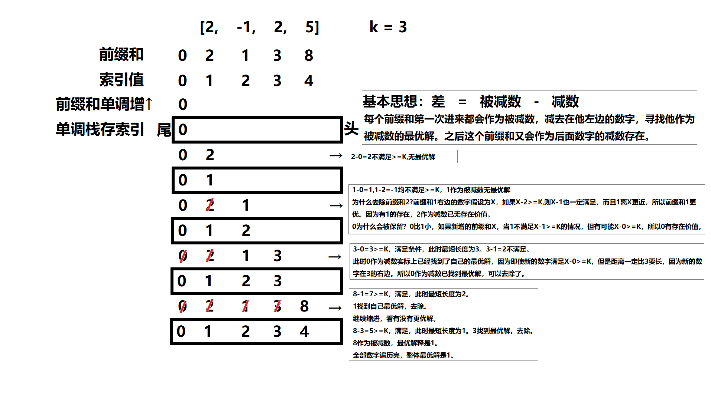
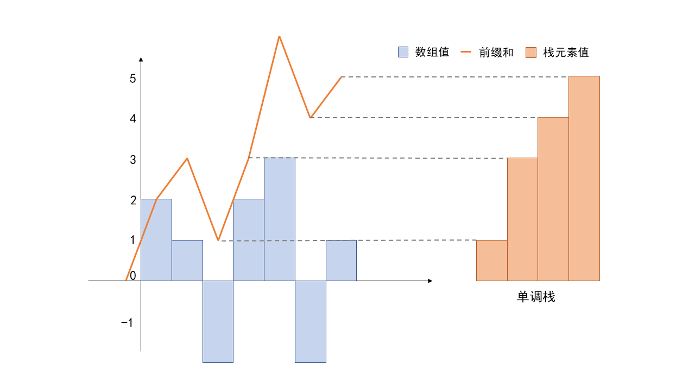
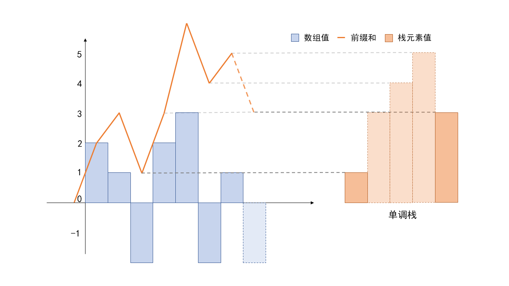
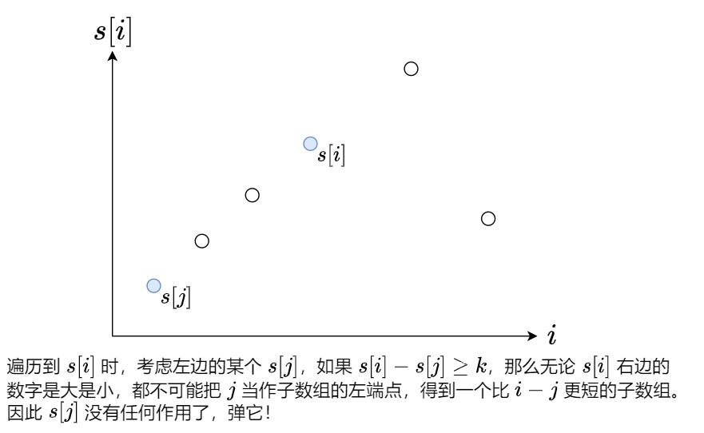
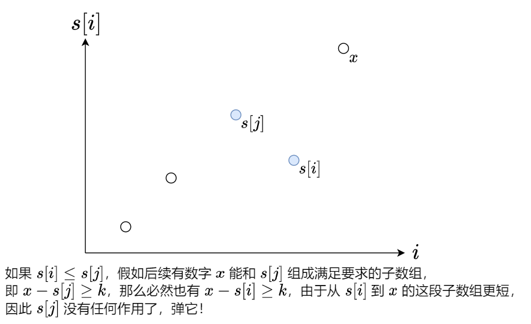

[#0862-shortest-subarray-with-sum-at-least-k]
= 862. 和至少为 K 的最短子数组

https://leetcode.cn/problems/shortest-subarray-with-sum-at-least-k/[LeetCode - 862. 和至少为 K 的最短子数组^]

给你一个整数数组 `nums` 和一个整数 `k` ，找出 `nums` 中和至少为 `k` 的 *最短非空子数组* ，并返回该子数组的长度。如果不存在这样的 *子数组* ，返回 `-1`。

*子数组* 是数组中 *连续* 的一部分。

*示例 1：*

....
输入：nums = [1], k = 1
输出：1
....

*示例 2：*

....
输入：nums = [1,2], k = 4
输出：-1
....

*示例 3：*

....
输入：nums = [2,-1,2], k = 3
输出：3
....

*提示：*

* `1 \<= nums.length \<= 10^5^`
* `-10^5^ \<= nums[i] \<= 10^5^`
* `1 \<= k \<= 10^9^`

== 思路分析

一脸懵逼！

[[src-0862]]
[tabs]
====
一刷::
+
--
[{java_src_attr}]
----
include::{sourcedir}/_0862_ShortestSubarrayWithSumAtLeastK.java[tag=answer]
----
--

// 二刷::
// +
// --
// [{java_src_attr}]
// ----
// include::{sourcedir}/_0862_ShortestSubarrayWithSumAtLeastK_2.java[tag=answer]
// ----
// --
====

== 参考资料

. https://leetcode.cn/problems/shortest-subarray-with-sum-at-least-k/solutions/1925100/by-vclip-x7h7/[862. 和至少为 K 的最短子数组 - O(nlogn) 单调栈解法及 O(n) 的单调队列优化^]
. https://leetcode.cn/problems/shortest-subarray-with-sum-at-least-k/solutions/1433630/tu-jie-by-wo-shi-a-miao-jiang-mpc7/[862. 和至少为 K 的最短子数组 - 图解前缀和+单调增^]
. https://leetcode.cn/problems/shortest-subarray-with-sum-at-least-k/solutions/1925036/liang-zhang-tu-miao-dong-dan-diao-dui-li-9fvh/[862. 和至少为 K 的最短子数组 - 两张图秒懂单调队列^]
. https://leetcode.cn/problems/shortest-subarray-with-sum-at-least-k/solutions/1923445/he-zhi-shao-wei-k-de-zui-duan-zi-shu-zu-57ffq/[862. 和至少为 K 的最短子数组 - 官方题解^]

