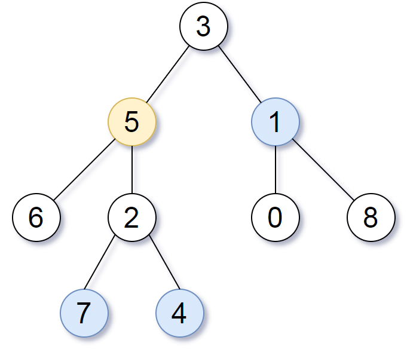

[#0863-all-nodes-distance-k-in-binary-tree]
= 863. 二叉树中所有距离为 K 的结点

https://leetcode.cn/problems/all-nodes-distance-k-in-binary-tree/[LeetCode - 863. 二叉树中所有距离为 K 的结点^]

给定一个二叉树（具有根结点 `root`）， 一个目标结点 `target`，和一个整数值 `k`，返回到目标结点 `target` 距离为 `k` 的所有结点的值的数组。

答案可以以 *任何顺序* 返回。

*示例 1：*

....
输入：root = [3,5,1,6,2,0,8,null,null,7,4], target = 5, k = 2
输出：[7,4,1]
解释：所求结点为与目标结点（值为 5）距离为 2 的结点，值分别为 7，4，以及 1
....

*示例 2:*

....
输入: root = [1], target = 1, k = 3
输出: []
....

*提示:*

* 节点数在 `[1, 500]` 范围内
* `0 \<= Node.val \<= 500`
* `Node.val` 中所有值 *不同*
* 目标结点 `target` 是树上的结点。
* `0 \<= k \<= 1000`

== 思路分析

先找出从根节点到目标节点之间的路径。再根据这个路径去做深度优先搜索，找到符合要求的节点。

TIP: 看了一圈题解，感觉我的题解最简洁。

[[src-0863]]
[tabs]
====
一刷::
+
--
[{java_src_attr}]
----
include::{sourcedir}/_0863_AllNodesDistanceKInBinaryTree.java[tag=answer]
----
--

// 二刷::
// +
// --
// [{java_src_attr}]
// ----
// include::{sourcedir}/_0863_AllNodesDistanceKInBinaryTree_2.java[tag=answer]
// ----
// --
====

== 参考资料

. https://leetcode.cn/problems/all-nodes-distance-k-in-binary-tree/solutions/900027/er-cha-shu-zhong-suo-you-ju-chi-wei-k-de-qbla/[863. 二叉树中所有距离为 K 的结点 - 官方题解^]
. https://leetcode.cn/problems/all-nodes-distance-k-in-binary-tree/solutions/900270/gong-shui-san-xie-yi-ti-shuang-jie-jian-x6hak/[863. 二叉树中所有距离为 K 的结点 - 一题双解 :「建图 + BFS」&「建图 + 迭代加深」^]
