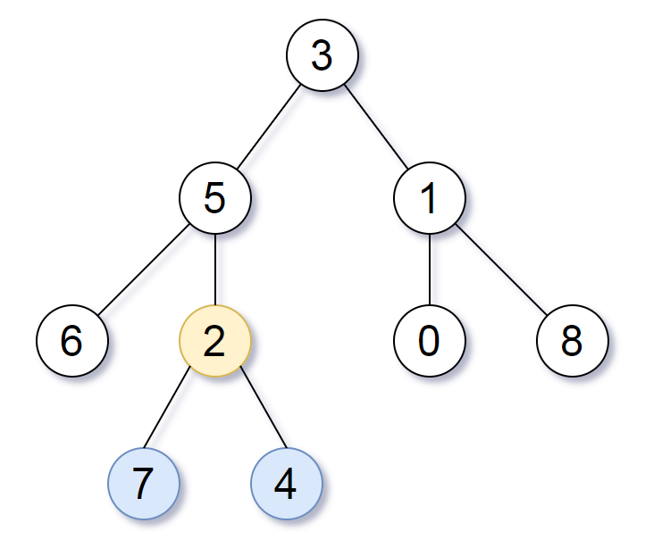

[#0865-smallest-subtree-with-all-the-deepest-nodes]
= 865. 具有所有最深节点的最小子树

https://leetcode.cn/problems/smallest-subtree-with-all-the-deepest-nodes/[LeetCode - 865. 具有所有最深节点的最小子树 ^]

给定一个根为 `root` 的二叉树，每个节点的深度是 *该节点到根的最短距离*。

返回包含原始树中所有 *最深节点* 的 _最小子树_ 。

如果一个节点在 *整个树* 的任意节点之间具有最大的深度，则该节点是 *最深的*。

一个节点的 *子树* 是该节点加上它的所有后代的集合。

*示例 1：*

....
输入：root = [3,5,1,6,2,0,8,null,null,7,4]
输出：[2,7,4]
解释：
我们返回值为 2 的节点，在图中用黄色标记。
在图中用蓝色标记的是树的最深的节点。
注意，节点 5、3 和 2 包含树中最深的节点，但节点 2 的子树最小，因此我们返回它。
....

*示例 2：*

....
输入：root = [1]
输出：[1]
解释：根节点是树中最深的节点。
....

*示例 3：*

....
输入：root = [0,1,3,null,2]
输出：[2]
解释：树中最深的节点为 2 ，有效子树为节点 2、1 和 0 的子树，但节点 2 的子树最小。
....

*提示：*

* 树中节点的数量在 `[1, 500]` 范围内。
* `+0 <= Node.val <= 500+`
* 每个节点的值都是 *独一无二* 的。

**注意：**本题与力扣 1123 重复：xref:1123-lowest-common-ancestor-of-deepest-leaves.adoc[1123. Lowest Common Ancestor of Deepest Leaves]

== 思路分析

直接递归，深度优先遍历，返回对应节点和最大深度，在“后序”阶段来处理逻辑，比较左右子树的最大深度一样，就返回当前节点和最大深度+1；否则，就返回有最大深度的节点，并且最大深度也+1。

[[src-0865]]
[tabs]
====
一刷::
+
--
[{java_src_attr}]
----
include::{sourcedir}/_0865_SmallestSubtreeWithAllTheDeepestNodes.java[tag=answer]
----
--

// 二刷::
// +
// --
// [{java_src_attr}]
// ----
// include::{sourcedir}/_0865_SmallestSubtreeWithAllTheDeepestNodes_2.java[tag=answer]
// ----
// --
====

== 参考资料

. https://leetcode.cn/problems/smallest-subtree-with-all-the-deepest-nodes/solutions/2428730/liang-chong-on-di-gui-xie-fa-pythonjavac-hac3/[865. 具有所有最深节点的最小子树 - 两种 O(n) 递归写法^]
. https://leetcode.cn/problems/smallest-subtree-with-all-the-deepest-nodes/solutions/18767/ju-you-suo-you-zui-shen-jie-dian-de-zui-xiao-zi-sh/[865. 具有所有最深节点的最小子树 - 官方题解^]
