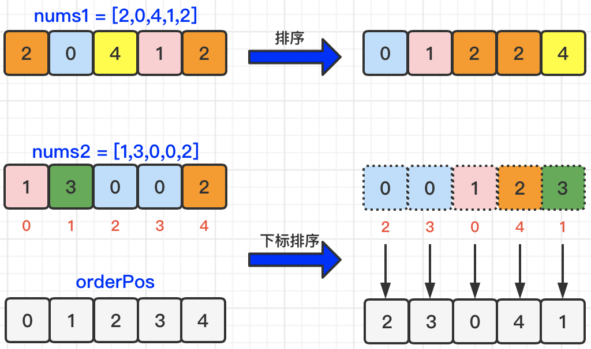
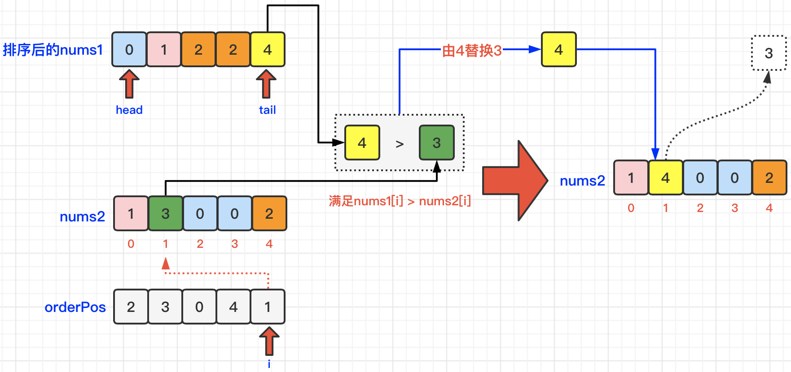
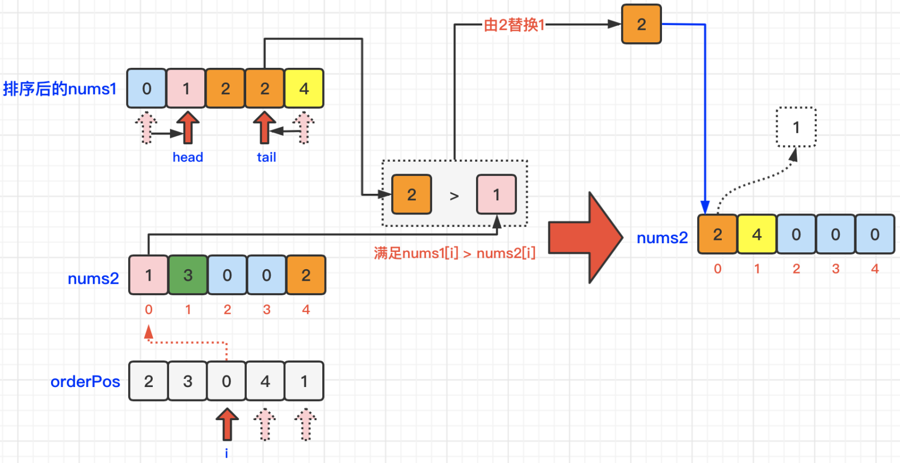

[#0870-advantage-shuffle]
= 870. Advantage Shuffle

https://leetcode.com/problems/advantage-shuffle/[LeetCode - Advantage Shuffle^]

Given two arrays `A` and `B` of equal size, the _advantage of `A` with respect to `B`_ is the number of indices `i` for which `A[i] > B[i]`.

Return *any* permutation of `A` that maximizes its advantage with respect to `B`.

*Example 1:*

[subs="verbatim,quotes,macros"]
----
*Input:* A = [2,7,11,15], B = [1,10,4,11]
*Output:* [2,11,7,15]
----

*Example 2:*

[subs="verbatim,quotes,macros"]
----
*Input:* A = [12,24,8,32], B = [13,25,32,11]
*Output:* [24,32,8,12]
----

*Note:*

. `1 <= A.length = B.length <= 10000`
. `0 <= A[i] <= 10^9`
. `0 <= B[i] <= 10^9`

== 思路分析

[[src-0870]]
[tabs]
====
一刷::
+
--
[{java_src_attr}]
----
include::{sourcedir}/_0870_AdvantageShuffle.java[tag=answer]
----
--

// 二刷::
// +
// --
// [{java_src_attr}]
// ----
// include::{sourcedir}/_0870_AdvantageShuffle_2.java[tag=answer]
// ----
// --
====

== 参考资料

. https://leetcode.cn/problems/advantage-shuffle/solutions/1869427/you-shi-xi-pai-by-leetcode-solution-sqsf/[870. 优势洗牌 - 官方题解^]
. https://leetcode.cn/problems/advantage-shuffle/solutions/1876089/-by-muse-77-ajqp/[870. 优势洗牌 - 【爪哇缪斯】图解LeetCode^]
. https://leetcode.cn/problems/advantage-shuffle/solutions/1875994/tian-ji-sai-ma-by-endlesscheng-yxm6/[870. 优势洗牌 - 田忌赛马（Python/Java/C++/Go）^]

