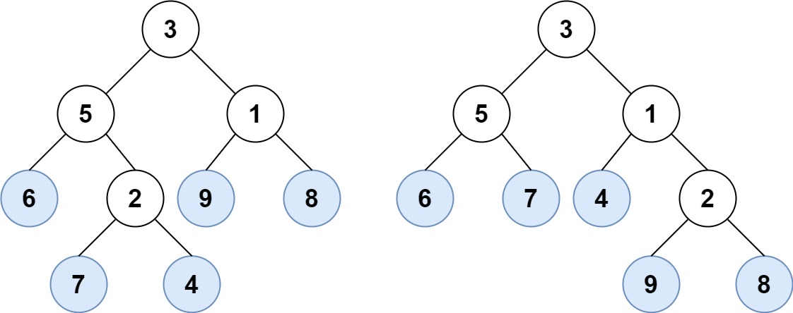

[#0872-leaf-similar-trees]
= 872. 叶子相似的树

https://leetcode.cn/problems/leaf-similar-trees/[LeetCode - 872. 叶子相似的树^]

请考虑一棵二叉树上所有的叶子，这些叶子的值按从左到右的顺序排列形成一个 *叶值序列*。

image::images/0872-01.png[{image_attr}]

举个例子，如上图所示，给定一棵叶值序列为 `(6, 7, 4, 9, 8)` 的树。

如果有两棵二叉树的叶值序列是相同，那么我们就认为它们是__叶相似__的。

如果给定的两个根结点分别为 `root1` 和 `root2` 的树是叶相似的，则返回 `true`；否则返回 `false` 。

*示例 1：*

....
输入：root1 = [3,5,1,6,2,9,8,null,null,7,4], root2 = [3,5,1,6,7,4,2,null,null,null,null,null,null,9,8]
输出：true
....

*示例 2：*

image::images/0872-03.jpg[{image_attr}]

....
输入：root1 = [1,2,3], root2 = [1,3,2]
输出：false
....

*提示：*

* 给定的两棵树结点数在 `[1, 200]` 范围内
* 给定的两棵树上的值在 `[0, 200]` 范围内

== 思路分析

最优解是深度优先遍历，我用的是迭代法。

[[src-0872]]
[tabs]
====
一刷::
+
--
[{java_src_attr}]
----
include::{sourcedir}/_0872_LeafSimilarTrees.java[tag=answer]
----
--

// 二刷::
// +
// --
// [{java_src_attr}]
// ----
// include::{sourcedir}/_0872_LeafSimilarTrees_2.java[tag=answer]
// ----
// --
====

== 参考资料

. https://leetcode.cn/problems/leaf-similar-trees/solutions/755642/xie-zi-xiang-si-de-shu-by-leetcode-solut-z0w6/[872. 叶子相似的树 - 官方题解^]
. https://leetcode.cn/problems/leaf-similar-trees/solutions/3741528/jian-dan-ti-jian-dan-zuo-pythonjavacgojs-b8ns/[872. 叶子相似的树 - 简单题，简单做^]
. https://leetcode.cn/problems/leaf-similar-trees/solutions/767347/gong-shui-san-xie-yi-ti-shuang-jie-di-gu-udfc/[872. 叶子相似的树 - 一题双解 : 「递归」&「迭代」^]
