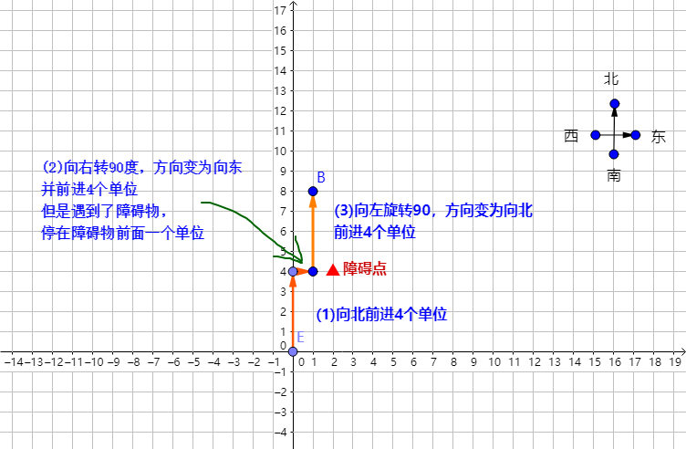

[#0874-walking-robot-simulation]
= 874. 模拟行走机器人

https://leetcode.cn/problems/walking-robot-simulation/[LeetCode - 874. 模拟行走机器人^]

机器人在一个无限大小的 XY 网格平面上行走，从点 `(0, 0)` 处开始出发，面向北方。该机器人可以接收以下三种类型的命令 `commands`：

* `-2` ：向左转 `90` 度
* `-1` ：向右转 `90` 度
* `1 \<= x \<= 9` ：向前移动 `x` 个单位长度

在网格上有一些格子被视为障碍物 `obstacles` 。第 `i` 个障碍物位于网格点 `obstacles[i] = (x~i~, y~i~)`。

机器人无法走到障碍物上，它将会停留在障碍物的前一个网格方块上，并继续执行下一个命令。

返回机器人距离原点的 *最大欧式距离* 的 *平方* 。（即，如果距离为 `5`，则返回 `25` ）

*注意：*

* 北方表示 +Y 方向。
* 东方表示 +X 方向。
* 南方表示 -Y 方向。
* 西方表示 -X 方向。
* 原点 [0,0] 可能会有障碍物。

*示例 1：*

....
输入：commands = [4,-1,3], obstacles = []
输出：25
解释：
机器人开始位于 (0, 0)：
1. 向北移动 4 个单位，到达 (0, 4)
2. 右转
3. 向东移动 3 个单位，到达 (3, 4)
距离原点最远的是 (3, 4) ，距离为 32 + 42 = 25
....

*示例 2：*

....
输入：commands = [4,-1,4,-2,4], obstacles = [[2,4]]
输出：65
解释：机器人开始位于 (0, 0)：
1. 向北移动 4 个单位，到达 (0, 4)
2. 右转
3. 向东移动 1 个单位，然后被位于 (2, 4) 的障碍物阻挡，机器人停在 (1, 4)
4. 左转
5. 向北走 4 个单位，到达 (1, 8)
距离原点最远的是 (1, 8) ，距离为 12 + 82 = 65
....

*示例 3：*

....
输入：commands = [6,-1,-1,6], obstacles = []
输出：36
解释：机器人开始位于 (0, 0):
1. 向北移动 6 个单位，到达 (0, 6).
2. 右转
3. 右转
4. 向南移动 6 个单位，到达 (0, 0).
机器人距离原点最远的点是 (0, 6)，其距离的平方是 62 = 36 个单位。
....

*提示：*

* `1 \<= commands.length \<= 10^4^`
* `commands[i]` 的值可以取 `-2`、`-1` 或者是范围 `[1, 9]` 内的一个整数。
* `0 \<= obstacles.length \<= 10^4^`
* `-3 * 10^4^ \<= x~i~, y~i~ \<= 3 * 10^4^`
* 答案保证小于 `2^31^`

== 思路分析

模拟题：注意方向的抽象和障碍避让的处理。

[[src-0874]]
[tabs]
====
一刷::
+
--
[{java_src_attr}]
----
include::{sourcedir}/_0874_WalkingRobotSimulation.java[tag=answer]
----
--

// 二刷::
// +
// --
// [{java_src_attr}]
// ----
// include::{sourcedir}/_0874_WalkingRobotSimulation_2.java[tag=answer]
// ----
// --
====

== 参考资料

. https://leetcode.cn/problems/walking-robot-simulation/solutions/[874. 模拟行走机器人 - 官方题解^]
. https://leetcode.cn/problems/walking-robot-simulation/solutions/3937384/li-yong-xiang-liang-shu-zu-jian-hua-dai-s8s3d/[874. 模拟行走机器人 - 利用向量数组简化代码^]
. https://leetcode.cn/problems/walking-robot-simulation/solutions/306901/tu-jie-mo-ni-xing-zou-ji-qi-ren-by-dekeshile/[874. 模拟行走机器人 - 图解^]
