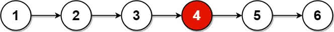
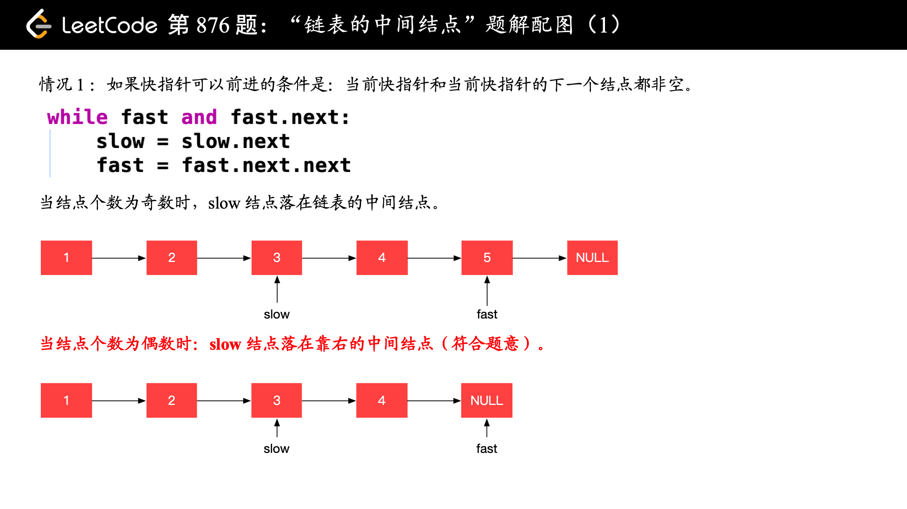
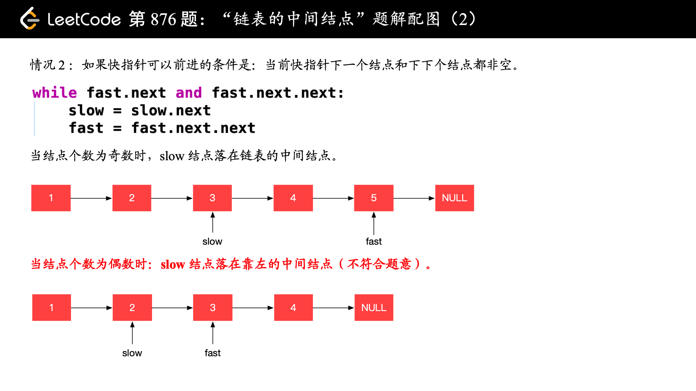

[#0876-middle-of-the-linked-list]
= 876. Middle of the Linked List

{leetcode}/problems/middle-of-the-linked-list/[LeetCode - Middle of the Linked List^]

Given a non-empty, singly linked list with head node `head`, return a middle node of linked list.

If there are two middle nodes, return the second middle node.

*Example 1:*

[subs="verbatim,quotes,macros"]
----
*Input:* [1,2,3,4,5]
*Output:* Node 3 from this list (Serialization: [3,4,5])
The returned node has value 3.  (The judge's serialization of this node is [3,4,5]).
Note that we returned a ListNode object ans, such that:
ans.val = 3, ans.next.val = 4, ans.next.next.val = 5, and ans.next.next.next = NULL.
----

*Example 2:*

[subs="verbatim,quotes,macros"]
----
*Input:* [1,2,3,4,5,6]
*Output:* Node 4 from this list (Serialization: [4,5,6])
Since the list has two middle nodes with values 3 and 4, we return the second one.
----

*Note:*

* The number of nodes in the given list will be between `1` and `100`.

== 解题分析

快慢指针，注意最后节点的处理。

[[src-0876]]
[{java_src_attr}]
----
include::{sourcedir}/_0876_MiddleOfTheLinkedList.java[tag=answer]
----

== 参考资料

. https://leetcode.cn/problems/middle-of-the-linked-list/solutions/164351/lian-biao-de-zhong-jian-jie-dian-by-leetcode-solut/[876. 链表的中间结点 - 官方题解^]
. https://leetcode.cn/problems/middle-of-the-linked-list/solutions/165152/kuai-man-zhi-zhen-zhu-yao-zai-yu-diao-shi-by-liwei/[876. 链表的中间结点 - 注意链表长度为偶数时，返回第 2 个结点的细节^]

