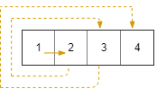
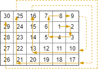

[#0885-spiral-matrix-iii]
= 885. 螺旋矩阵 III

https://leetcode.cn/problems/spiral-matrix-iii/[LeetCode - 885. 螺旋矩阵 III^]

在 `rows x cols` 的网格上，你从单元格 `(r~Start~, c~Start~)` 面朝东面开始。网格的西北角位于第一行第一列，网格的东南角位于最后一行最后一列。

你需要以顺时针按螺旋状行走，访问此网格中的每个位置。每当移动到网格的边界之外时，需要继续在网格之外行走（但稍后可能会返回到网格边界）。

最终，我们到过网格的所有 `rows x cols` 个空间。

按照访问顺序返回表示网格位置的坐标列表。

*示例 1：*

....
输入：rows = 1, cols = 4, rStart = 0, cStart = 0
输出：[[0,0],[0,1],[0,2],[0,3]]
....

*示例 2：*

....
输入：rows = 5, cols = 6, rStart = 1, cStart = 4
输出：[[1,4],[1,5],[2,5],[2,4],[2,3],[1,3],[0,3],[0,4],[0,5],[3,5],[3,4],[3,3],[3,2],[2,2],[1,2],[0,2],[4,5],[4,4],[4,3],[4,2],[4,1],[3,1],[2,1],[1,1],[0,1],[4,0],[3,0],[2,0],[1,0],[0,0]]
....

*提示：*

* `1 \<= rows, cols \<= 100`
* `0 \<= rStart < rows`
* `0 \<= cStart < cols`

== 思路分析

在每个方向的行走长度，我们发现如下模式：1，1，2，2，3，3，4，4，... 即我们先向东走 1 单位，然后向南走 1 单位，再向西走 2 单位，再向北走 2 单位，再向东走 3 单位，等等。

按照我们访问的顺序执行遍历并记录网格的位置。

[[src-0885]]
[tabs]
====
一刷::
+
--
[{java_src_attr}]
----
include::{sourcedir}/_0885_SpiralMatrixIii.java[tag=answer]
----
--

// 二刷::
// +
// --
// [{java_src_attr}]
// ----
// include::{sourcedir}/_0885_SpiralMatrixIii_2.java[tag=answer]
// ----
// --
====

== 参考资料

. https://leetcode.cn/problems/spiral-matrix-iii/solutions/3546/luo-xuan-ju-zhen-iii-by-leetcode/[885. 螺旋矩阵 III - 官方题解^]
. https://leetcode.cn/problems/spiral-matrix-iii/solutions/660264/dongge-de-jie-fa-si-lu-qing-xi-by-victor-gmmz/[885. 螺旋矩阵 III - Dong哥的解法，思路清晰^]
