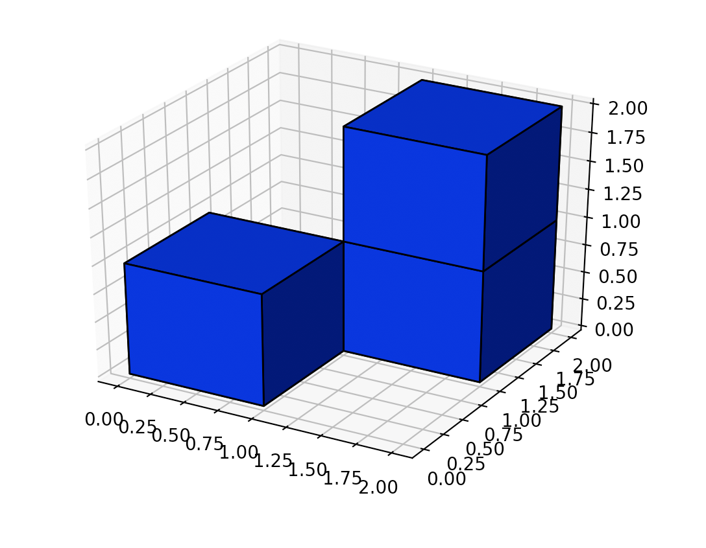

[#0892-surface-area-of-3d-shapes]
= 892. Surface Area of 3D Shapes

{leetcode}/problems/surface-area-of-3d-shapes/[LeetCode - Surface Area of 3D Shapes^]

On a `N * N` grid, we place some `1 * 1 * 1 `cubes.

Each value `v = grid[i][j]` represents a tower of `v` cubes placed on top of grid cell `(i, j)`.

Return the total surface area of the resulting shapes.

*Example 1:*

[subs="verbatim,quotes,macros"]
----
*Input:* [[2]]
*Output:* 10
----

*Example 2:*

[subs="verbatim,quotes,macros"]
----
*Input:* [[1,2],[3,4]]
*Output:* 34
----

*Example 3:*

[subs="verbatim,quotes,macros"]
----
*Input:* [[1,0],[0,2]]
*Output:* 16
----

*Example 4:*

[subs="verbatim,quotes,macros"]
----
*Input:* [[1,1,1],[1,0,1],[1,1,1]]
*Output:* 32
----

*Example 5:*

[subs="verbatim,quotes,macros"]
----
*Input:* [[2,2,2],[2,1,2],[2,2,2]]
*Output:* 46
----

 

*Note:*

* `1 \<= N \<= 50`
* `0 \<= grid[i][j] \<= 50`

== 思路分析

这就是求立方体的表面积。

image::images/0892-02.png[{image_attr}]

image::images/0892-04.png[{image_attr}]

计算各个方块柱子的表面积相加。

[[src-0892]]
[tabs]
====
一刷::
+
--
[{java_src_attr}]
----
include::{sourcedir}/_0892_SurfaceAreaOf3DShapes.java[tag=answer]
----
--

// 二刷::
// +
// --
// [{java_src_attr}]
// ----
// include::{sourcedir}/_0892_SurfaceAreaOf3DShapes_2.java[tag=answer]
// ----
// --
====

== 参考资料

. https://leetcode.cn/problems/surface-area-of-3d-shapes/solutions/1/shi-li-you-tu-you-zhen-xiang-jiang-jie-yi-kan-jiu-/[892. 三维形体的表面积 - 3ms, 有图有真相, 一看就明白, Java^]
. https://leetcode.cn/problems/surface-area-of-3d-shapes/solutions/168669/san-wei-xing-ti-de-biao-mian-ji-by-leetcode-soluti/[892. 三维形体的表面积 - 官方题解有些懵逼^]

