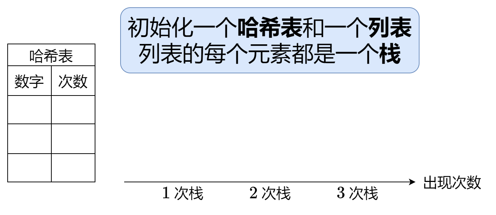
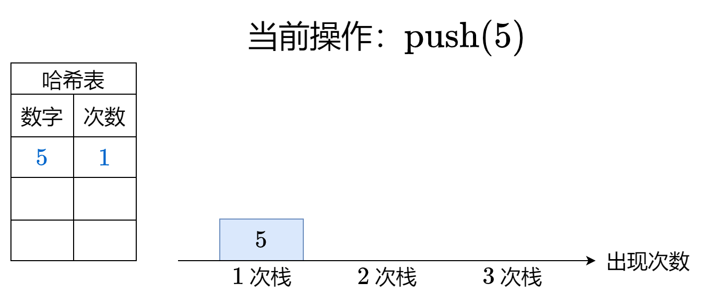
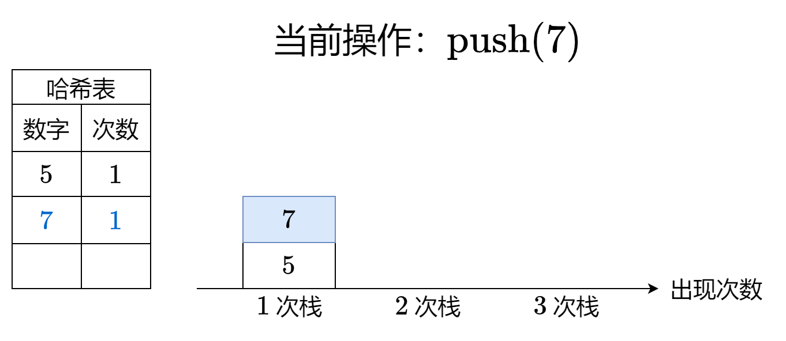
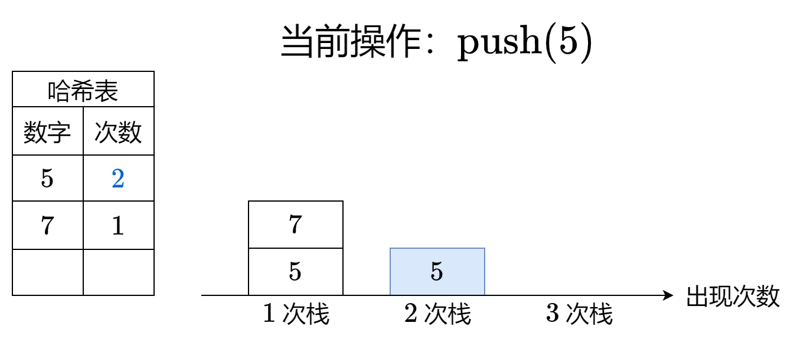
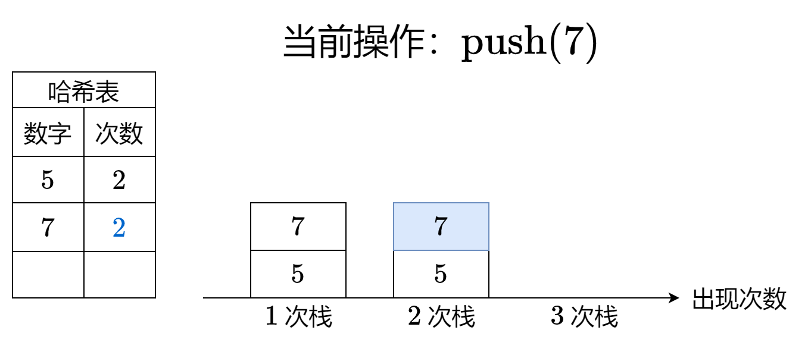
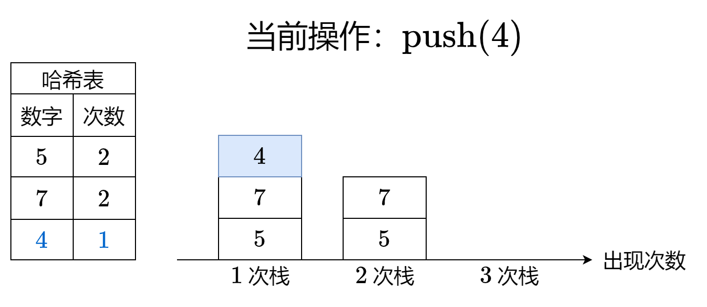
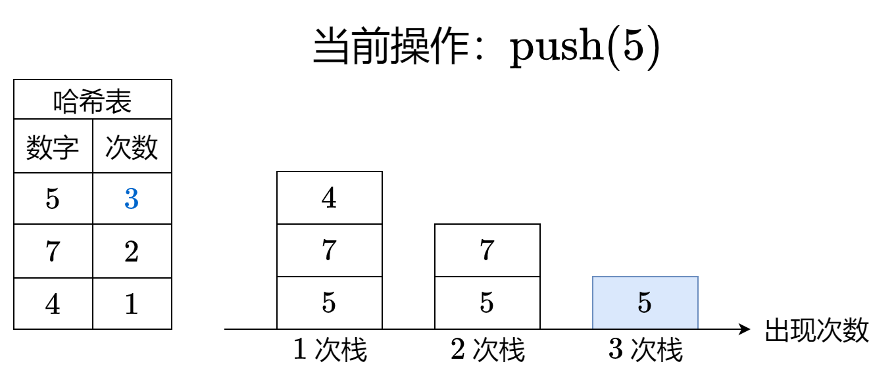
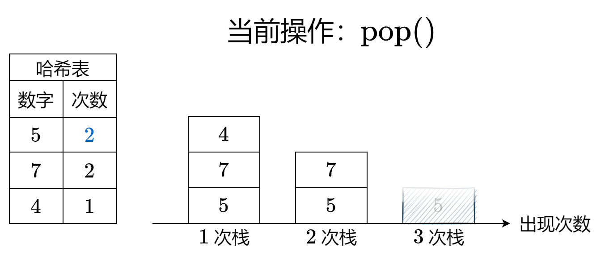
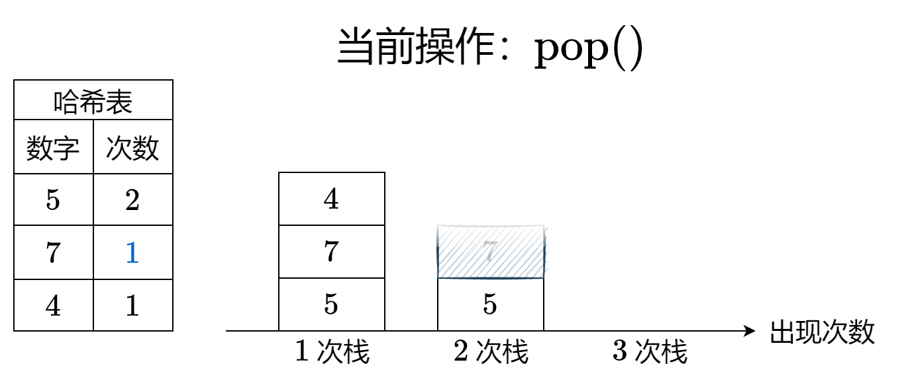
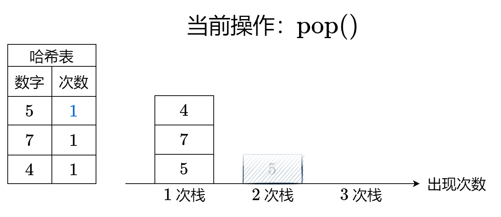

[#0895-maximum-frequency-stack]
= 895. 最大频率栈

https://leetcode.cn/problems/maximum-frequency-stack/[LeetCode - 895. 最大频率栈^]

设计一个类似堆栈的数据结构，将元素推入堆栈，并从堆栈中弹出**出现频率**最高的元素。

实现 `FreqStack` 类:

* `FreqStack()` 构造一个空的堆栈。
* `void push(int val)` 将一个整数 `val` 压入栈顶。
* `int pop()` 删除并返回堆栈中出现频率最高的元素。
** 如果出现频率最高的元素不只一个，则移除并返回最接近栈顶的元素。

*示例 1：*

....
输入：
["FreqStack","push","push","push","push","push","push","pop","pop","pop","pop"],
[[],[5],[7],[5],[7],[4],[5],[],[],[],[]]
输出：[null,null,null,null,null,null,null,5,7,5,4]
解释：
FreqStack = new FreqStack();
freqStack.push (5);//堆栈为 [5]
freqStack.push (7);//堆栈是 [5,7]
freqStack.push (5);//堆栈是 [5,7,5]
freqStack.push (7);//堆栈是 [5,7,5,7]
freqStack.push (4);//堆栈是 [5,7,5,7,4]
freqStack.push (5);//堆栈是 [5,7,5,7,4,5]
freqStack.pop ();//返回 5 ，因为 5 出现频率最高。堆栈变成 [5,7,5,7,4]。
freqStack.pop ();//返回 7 ，因为 5 和 7 出现频率最高，但7最接近顶部。堆栈变成 [5,7,5,4]。
freqStack.pop ();//返回 5 ，因为 5 出现频率最高。堆栈变成 [5,7,4]。
freqStack.pop ();//返回 4 ，因为 4, 5 和 7 出现频率最高，但 4 是最接近顶部的。堆栈变成 [5,7]。
....

*提示：*

* `0 \<= val \<= 10^9^`
* `push` 和 `pop` 的操作数不大于 `2 * 10^4^`。
* 输入保证在调用 `pop` 之前堆栈中至少有一个元素。

== 思路分析

只想到使用哈希记录出现次数，没想到可以根据出现次数去建立多个栈。

[[src-0895]]
[tabs]
====
一刷::
+
--
[{java_src_attr}]
----
include::{sourcedir}/_0895_MaximumFrequencyStack.java[tag=answer]
----
--

// 二刷::
// +
// --
// [{java_src_attr}]
// ----
// include::{sourcedir}/_0895_MaximumFrequencyStack_2.java[tag=answer]
// ----
// --
====

== 参考资料

. https://leetcode.cn/problems/maximum-frequency-stack/solutions/1998430/mei-xiang-ming-bai-yi-ge-dong-hua-miao-d-oich/[895. 最大频率栈 - 【动画】没想明白？一个动画秒懂！^]
. https://leetcode.cn/problems/maximum-frequency-stack/solutions/1997251/zui-da-pin-lu-zhan-by-leetcode-solution-moay/[895. 最大频率栈 - 官方题解^]
. https://leetcode.cn/problems/maximum-frequency-stack/solutions/1998468/-by-muse-77-bzg6/[895. 最大频率栈 - 图解LeetCode^]
