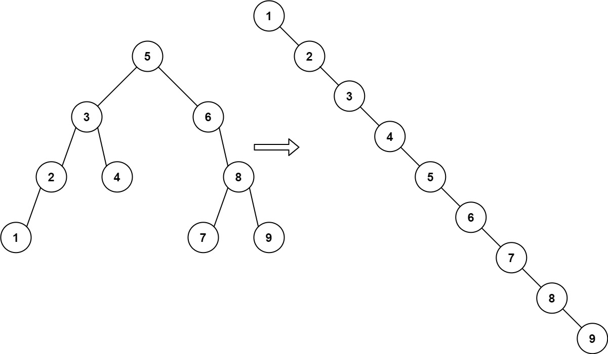
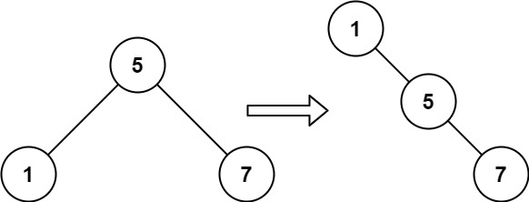

[#0897-increasing-order-search-tree]
= 897. 递增顺序搜索树

https://leetcode.cn/problems/increasing-order-search-tree/[LeetCode - 897. 递增顺序搜索树^]

给你一棵二叉搜索树的 `root` ，请你 *按中序遍历* 将其重新排列为一棵递增顺序搜索树，使树中最左边的节点成为树的根节点，并且每个节点没有左子节点，只有一个右子节点。

*示例 1：*

....
输入：root = [5,3,6,2,4,null,8,1,null,null,null,7,9]
输出：[1,null,2,null,3,null,4,null,5,null,6,null,7,null,8,null,9]
....

*示例 2：*

....
输入：root = [5,1,7]
输出：[1,null,5,null,7]
....

*提示：*

* 树中节点数的取值范围是 `[1, 100]`
* `0 \<= Node.val \<= 1000`

== 思路分析

深度优先遍历。直接在深度优先遍历的时候，把指针改掉的解法，还要多思考一下。另外，也可以思考一下 Morris 遍历解法。

[[src-0897]]
[tabs]
====
一刷::
+
--
[{java_src_attr}]
----
include::{sourcedir}/_0897_IncreasingOrderSearchTree.java[tag=answer]
----
--

// 二刷::
// +
// --
// [{java_src_attr}]
// ----
// include::{sourcedir}/_0897_IncreasingOrderSearchTree_2.java[tag=answer]
// ----
// --
====

== 参考资料

. https://leetcode.cn/problems/increasing-order-search-tree/solutions/741961/di-zeng-shun-xu-cha-zhao-shu-by-leetcode-dfrr/[897. 递增顺序搜索树 - 官方题解^]
. https://leetcode.cn/problems/increasing-order-search-tree/solutions/742210/fu-xue-ming-zhu-fen-xiang-er-cha-shu-san-hljt/[897. 递增顺序搜索树 - 分享二叉树三种遍历方式的模板^]
