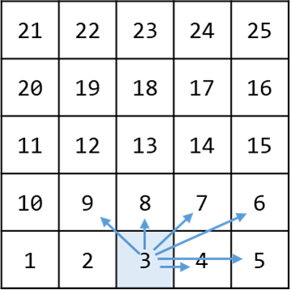
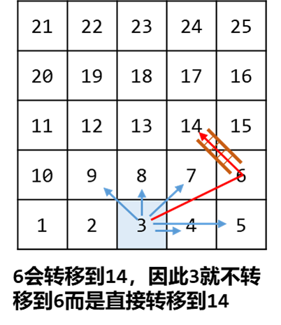
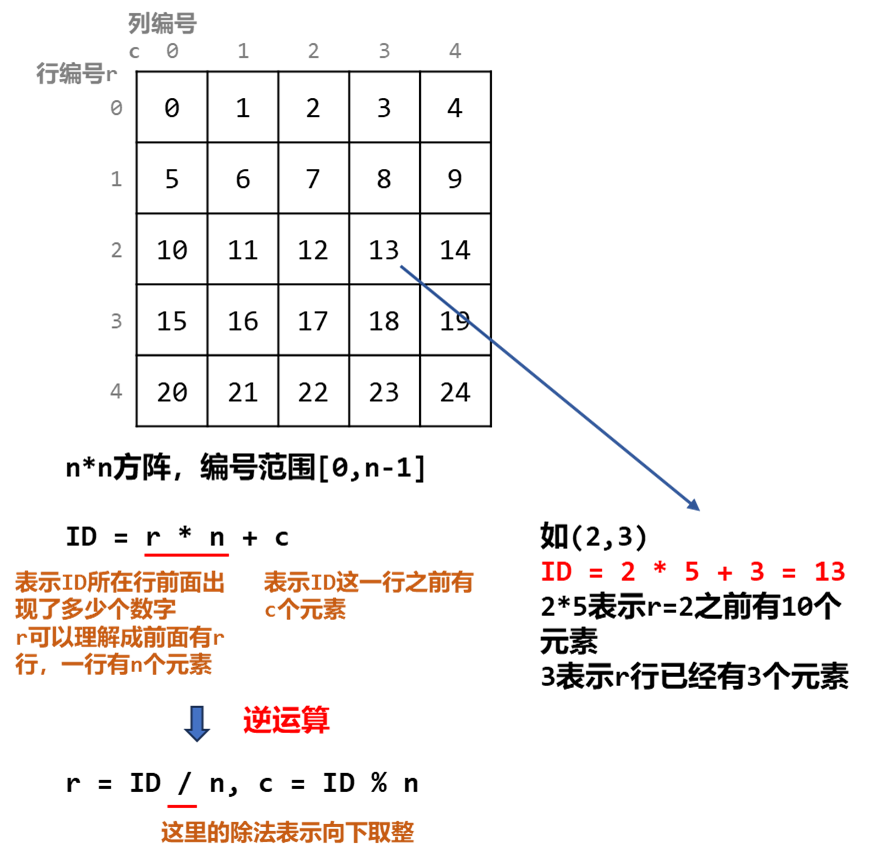
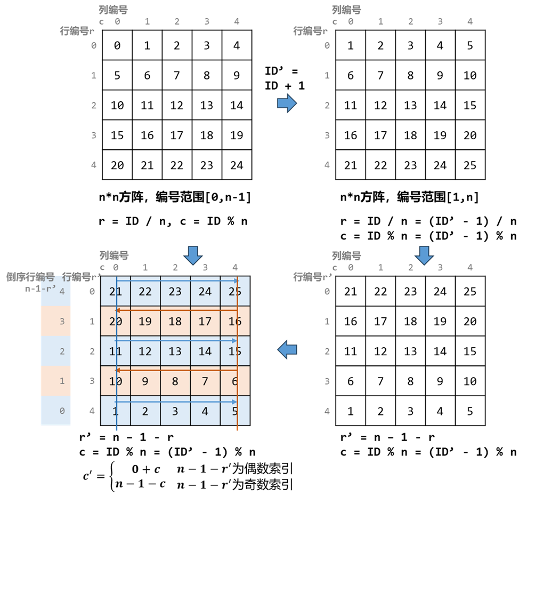

[#0909-snakes-and-ladders]
= 909. 蛇梯棋

https://leetcode.cn/problems/snakes-and-ladders/[LeetCode - 909. 蛇梯棋 ^]

给你一个大小为 `n x n` 的整数矩阵 `board` ，方格按从 `1` 到 `n^2^` 编号，编号遵循
https://baike.baidu.com/item/%E7%89%9B%E8%80%95%E5%BC%8F%E8%BD%AC%E8%A1%8C%E4%B9%A6%E5%86%99%E6%B3%95/17195786[转行交替方式]，*从左下角开始* （即，从 `board[n - 1][0]` 开始）的每一行改变方向。

你一开始位于棋盘上的方格  `1`。每一回合，玩家需要从当前方格 `curr` 开始出发，按下述要求前进：

* 选定目标方格 `next`，目标方格的编号在范围 `[curr + 1, min(curr + 6, n^2^)]` 。
** 该选择模拟了掷 *六面体骰子* 的情景，无论棋盘大小如何，玩家最多只能有 6 个目的地。
* 传送玩家：如果目标方格 `next` 处存在蛇或梯子，那么玩家会传送到蛇或梯子的目的地。否则，玩家传送到目标方格 `next` 。
* 当玩家到达编号 `n`^`2`^ 的方格时，游戏结束。

如果 `board[r][c] != -1` ，位于 `r` 行 `c` 列的棋盘格中可能存在 “蛇” 或 “梯子”。那个蛇或梯子的目的地将会是 `+board[r][c]+`。编号为 `1` 和 `n^2^` 的方格不是任何蛇或梯子的起点。

注意，玩家在每回合的前进过程中最多只能爬过蛇或梯子一次：就算目的地是另一条蛇或梯子的起点，玩家也 *不能* 继续移动。

* 举个例子，假设棋盘是 `[[-1,4],[-1,3]]`，第一次移动，玩家的目标方格是 `2` 。那么这个玩家将会顺着梯子到达方格 `3` ，但 *不能* 顺着方格 `3` 上的梯子前往方格 `4`。（简单来说，类似飞行棋，玩家掷出骰子点数后移动对应格数，遇到单向的路径（即梯子或蛇）可以直接跳到路径的终点，但如果多个路径首尾相连，也不能连续跳多个路径）

返回达到编号为 `n^2^` 的方格所需的最少移动次数，如果不可能，则返回 `-1`。

*示例 1：*

image::images/0909-01.png[{image_attr}]

....
输入：board = [
               [-1,-1,-1,-1,-1,-1],
               [-1,-1,-1,-1,-1,-1],
               [-1,-1,-1,-1,-1,-1],
               [-1,35,-1,-1,13,-1],
               [-1,-1,-1,-1,-1,-1],
               [-1,15,-1,-1,-1,-1]
             ]
输出：4
解释：
首先，从方格 1 [第 5 行，第 0 列] 开始。
先决定移动到方格 2 ，并必须爬过梯子移动到到方格 15 。
然后决定移动到方格 17 [第 3 行，第 4 列]，必须爬过蛇到方格 13 。
接着决定移动到方格 14 ，且必须通过梯子移动到方格 35 。
最后决定移动到方格 36 , 游戏结束。
可以证明需要至少 4 次移动才能到达最后一个方格，所以答案是 4 。
....

*示例 2：*

....
输入：board = [
               [-1,-1],
               [-1,3]
             ]
输出：1
....

*提示：*

* `n == board.length == board[i].length`
* `+2 <= n <= 20+`
* `board[i][j]` 的值是 `-1` 或在范围 `[1, n^2^]` 内
* 编号为 `1` 和 `n^2^` 的方格上没有蛇或梯子

== 思路分析

广度优先遍历！先建立矩阵坐标到数字和数字到矩阵坐标的关联关系！然后，就是出队，构建下一步到底的节点，再入队，直到终点，或者不可到达。

使用移位将坐标转换成一个数字，在一个 `Map` 对象中存正向和反向的对应关系。

看题解，可以把矩阵转换成一维数组，这样更高效，又学了一招！

[[src-0909]]
[tabs]
====
一刷::
+
--
[{java_src_attr}]
----
include::{sourcedir}/_0909_SnakesAndLadders.java[tag=answer]
----
--

// 二刷::
// +
// --
// [{java_src_attr}]
// ----
// include::{sourcedir}/_0909_SnakesAndLadders_2.java[tag=answer]
// ----
// --
====

== 参考资料

. https://leetcode.cn/problems/snakes-and-ladders/solutions/846667/gong-shui-san-xie-bfs-mo-ni-by-ac_oier-woh6/[909. 蛇梯棋 - 【宫水三叶】BFS 模拟运用题^] -- 看了很多题解，这个题解最简单！
. https://leetcode.cn/problems/snakes-and-ladders/solutions/2541552/javapython3cyan-du-you-xian-sou-suo-shu-27v0f/[909. 蛇梯棋 - 广度优先搜索 + 数学：根据编号获取所在方格位置【图解】^]
. https://leetcode.cn/problems/snakes-and-ladders/solutions/3690137/bfszhu-yi-ke-neng-you-huan-pythonjavacgo-xcy7/[909. 蛇梯棋 - BFS，注意可能有环^]
