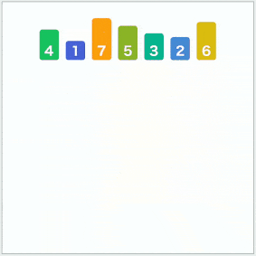
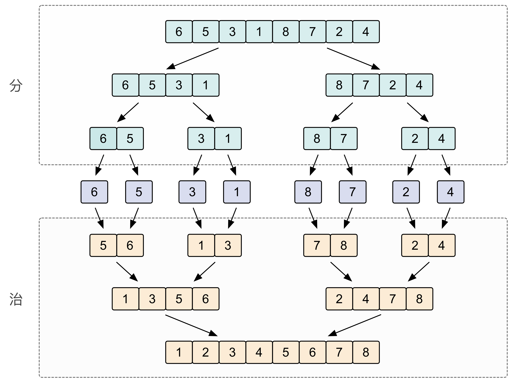
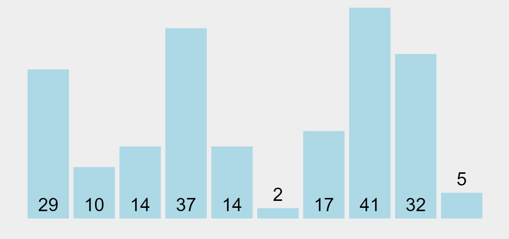

[#0912-sort-an-array]
= 912. Sort an Array

https://leetcode.com/problems/sort-an-array/[LeetCode - Sort an Array^]

Given an array of integers `nums`, sort the array in ascending order.

 
*Example 1:*

[subs="verbatim,quotes,macros"]
----
*Input:* nums = [5,2,3,1]
*Output:* [1,2,3,5]
----

*Example 2:*

[subs="verbatim,quotes,macros"]
----
*Input:* nums = [5,1,1,2,0,0]
*Output:* [0,0,1,1,2,5]
----
 
*Constraints:*

* `1 <= nums.length <= 50000`
* `-50000 <= nums[i] <= 50000`

== 思路分析

归并排序

image::images/merge-sort-01.gif[{image_attr}]

image::images/quick-sort-01.gif[{image_attr}]

image::images/quick-sort-03.png[{image_attr}]

[[src-0912]]
[{java_src_attr}]
----
include::{sourcedir}/_0912_SortAnArray.java[tag=answer]
----

== 参考资料

. https://leetcode.cn/problems/sort-an-array/solutions/178305/pai-xu-shu-zu-by-leetcode-solution/[912. 排序数组 - 官方题解^]
. https://leetcode.cn/problems/sort-an-array/solutions/179489/fu-xi-ji-chu-pai-xu-suan-fa-java-by-liweiwei1419/[912. 排序数组 - 复习基础排序算法^]
. https://leetcode.cn/problems/sort-an-array/solutions/1311934/duo-chong-pai-xu-yi-wang-da-jin-kuai-pai-wgz4/[912. 排序数组 - 『 3种排序一网打尽 』 快速排序、归并排序、堆排序详解^]

