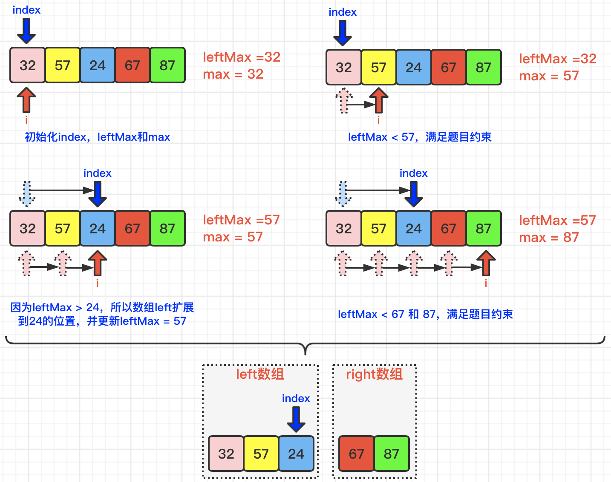

[#0915-partition-array-into-disjoint-intervals]
= 915. 分割数组

https://leetcode.cn/problems/partition-array-into-disjoint-intervals/[LeetCode - 915. 分割数组 ^]

给定一个数组 `nums` ，将其划分为两个连续子数组 `left` 和 `right`， 使得：

* `left` 中的每个元素都小于或等于 `right` 中的每个元素。
* `left` 和 `right` 都是非空的。
* `left` 的长度要尽可能小。

_在完成这样的分组后返回 `left` 的 *长度 *_。

用例可以保证存在这样的划分方法。

*示例 1：*

....
输入：nums = [5,0,3,8,6]
输出：3
解释：left = [5,0,3]，right = [8,6]
....

*示例 2：*

....
输入：nums = [1,1,1,0,6,12]
输出：4
解释：left = [1,1,1,0]，right = [6,12]
....

*提示：*

* `2 \<= nums.length \<= 10^5^`
* `0 \<= nums[i] \<= 10^6^`
* 可以保证至少有一种方法能够按题目所描述的那样对 `nums` 进行划分。

== 思路分析

两次遍历，先从右向左查找最小值，然后从左向右查找最大值，当最大值小于下一个的最小值，则就到了分界线。

下面这个题解更简单，只需要遍历不到一遍：

[[src-0915]]
[tabs]
====
一刷::
+
--
[{java_src_attr}]
----
include::{sourcedir}/_0915_PartitionArrayIntoDisjointIntervals.java[tag=answer]
----
--

// 二刷::
// +
// --
// [{java_src_attr}]
// ----
// include::{sourcedir}/_0915_PartitionArrayIntoDisjointIntervals_2.java[tag=answer]
// ----
// --
====

== 参考资料

. https://leetcode.cn/problems/partition-array-into-disjoint-intervals/solutions/1913934/fen-ge-shu-zu-by-leetcode-solution-t4pm/[915. 分割数组 - 官方题解^]
. https://leetcode.cn/problems/partition-array-into-disjoint-intervals/solutions/1920768/zhua-wa-mou-si-tu-jie-leetcode-by-muse-7-omut/[915. 分割数组 - 【爪哇缪斯】图解LeetCode^] -- 不到一遍的遍历，牛逼！
