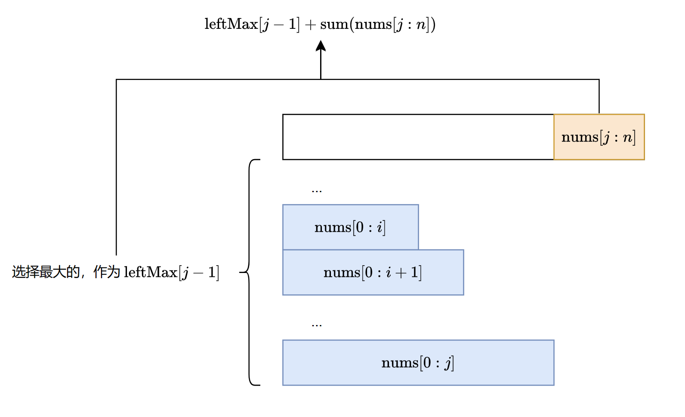

[#0918-maximum-sum-circular-subarray]
= 918. 环形子数组的最大和

https://leetcode.cn/problems/maximum-sum-circular-subarray/[LeetCode - 918. 环形子数组的最大和 ^]

给定一个长度为 `n` 的**环形整数数组** `nums` ，返回 __ `nums` 的非空 *子数组* 的最大可能和__。

*环形数组*__ __意味着数组的末端将会与开头相连呈环状。形式上，`+nums[i]+` 的下一个元素是 `nums[(i + 1) % n]` ，`nums[i]` 的前一个元素是 `nums[(i - 1 + n) % n]` 。

*子数组* 最多只能包含固定缓冲区 `nums` 中的每个元素一次。形式上，对于子数组 `nums[i], nums[i + 1], ..., nums[j]` ，不存在 `+i <= k1, k2 <= j+` 其中 `k1 % n == k2 % n` 。

*示例 1：*

....
输入：nums = [1,-2,3,-2]
输出：3
解释：从子数组 [3] 得到最大和 3
....

*示例 2：*

....
输入：nums = [5,-3,5]
输出：10
解释：从子数组 [5,5] 得到最大和 5 + 5 = 10
....

*示例 3：*

....
输入：nums = [3,-2,2,-3]
输出：3
解释：从子数组 [3] 和 [3,-2,2] 都可以得到最大和 3
....

*提示：*

* `+n == nums.length+`
* `1 \<= n \<= 3 * 10^4^`
* `-3 * 10^4^ \<= nums[i] \<= 3 * 10^4^`

== 思路分析

[[src-0918]]
[tabs]
====
一刷::
+
--
[{java_src_attr}]
----
include::{sourcedir}/_0918_MaximumSumCircularSubarray.java[tag=answer]
----
--

// 二刷::
// +
// --
// [{java_src_attr}]
// ----
// include::{sourcedir}/_0918_MaximumSumCircularSubarray_2.java[tag=answer]
// ----
// --
====

== 参考资料

. https://leetcode.cn/problems/maximum-sum-circular-subarray/solutions/2350660/huan-xing-zi-shu-zu-de-zui-da-he-by-leet-elou/[918. 环形子数组的最大和 - 官方题解^]
. https://leetcode.cn/problems/maximum-sum-circular-subarray/solutions/2351107/mei-you-si-lu-yi-zhang-tu-miao-dong-pyth-ilqh/[918. 环形子数组的最大和 - 没有思路？一张图秒懂！^]
