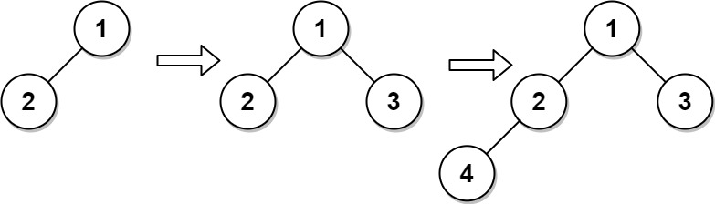

[#0919-complete-binary-tree-inserter]
= 919. 完全二叉树插入器

https://leetcode.cn/problems/complete-binary-tree-inserter/[LeetCode - 919. 完全二叉树插入器^]

*完全二叉树* 是每一层（除最后一层外）都是完全填充（即，节点数达到最大）的，并且所有的节点都尽可能地集中在左侧。

设计一种算法，将一个新节点插入到一棵完全二叉树中，并在插入后保持其完整。

实现 `CBTInserter` 类:

* `CBTInserter(TreeNode root)` 使用头节点为 `root` 的给定树初始化该数据结构；
* `CBTInserter.insert(int v)` 向树中插入一个值为 `Node.val == val`的新节点 `TreeNode`。使树保持完全二叉树的状态，*并返回插入节点* `TreeNode` *的父节点的值*；
* `CBTInserter.get_root()` 将返回树的头节点。

*示例 1：*

....
输入
["CBTInserter", "insert", "insert", "get_root"]
[[[1, 2]], [3], [4], []]
输出
[null, 1, 2, [1, 2, 3, 4]]

解释
CBTInserter cBTInserter = new CBTInserter([1, 2]);
cBTInserter.insert(3);  // 返回 1
cBTInserter.insert(4);  // 返回 2
cBTInserter.get_root(); // 返回 [1, 2, 3, 4]
....

*提示：*

* 树中节点数量范围为 `[1, 1000]`
* `0 \<= Node.val \<= 5000`
* `root` 是完全二叉树
* `0 \<= val \<= 5000`
* 每个测试用例最多调用 `insert` 和 `get_root` 操作 `10^4^` 次

== 思路分析

广度优先队列。可以缓存要插入的父节点队列，加快速度。

[[src-0919]]
[tabs]
====
一刷::
+
--
[{java_src_attr}]
----
include::{sourcedir}/_0919_CompleteBinaryTreeInserter.java[tag=answer]
----
--

// 二刷::
// +
// --
// [{java_src_attr}]
// ----
// include::{sourcedir}/_0919_CompleteBinaryTreeInserter_2.java[tag=answer]
// ----
// --
====

== 参考资料

. https://leetcode.cn/problems/complete-binary-tree-inserter/solutions/1689234/wan-quan-er-cha-shu-cha-ru-qi-by-leetcod-lf8t/[919. 完全二叉树插入器 - 官方题解^]
. https://leetcode.cn/problems/complete-binary-tree-inserter/solutions/1696367/by-ac_oier-t9dh/[919. 完全二叉树插入器 - 简单 BFS 运用题^]
