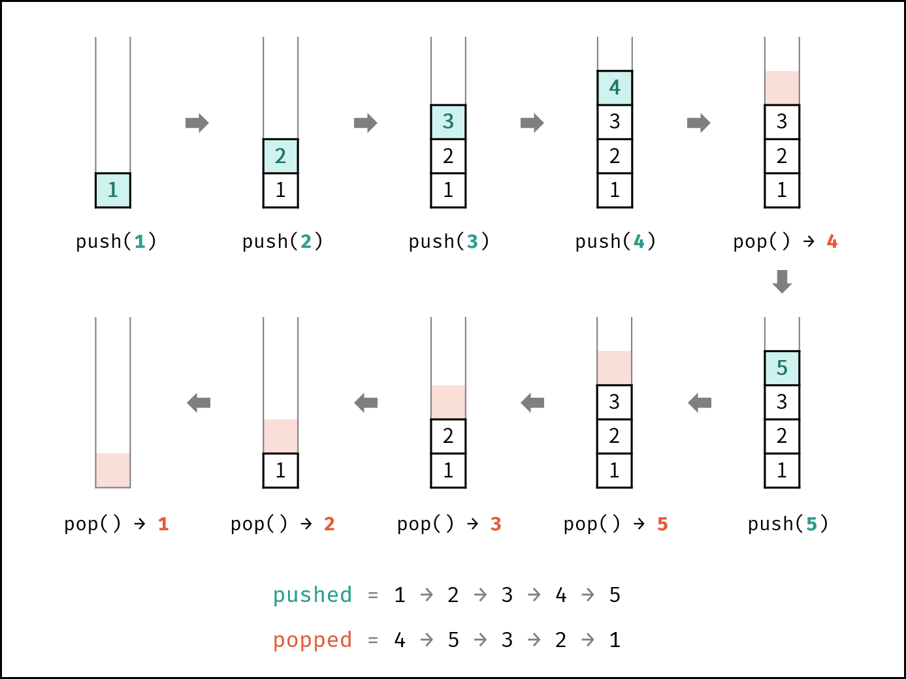
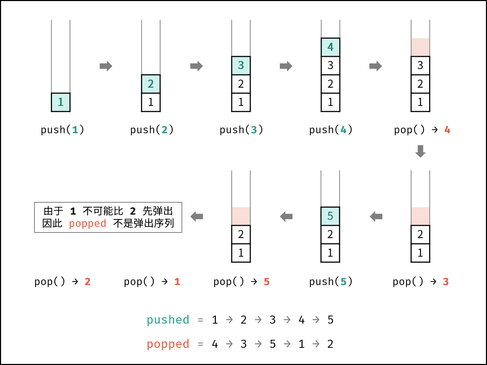

[#0946-validate-stack-sequences]
= 946. Validate Stack Sequences

{leetcode}/problems/validate-stack-sequences/[LeetCode - Validate Stack Sequences^]

Given two sequences `pushed` and `popped` *with distinct values*, return `true` if and only if this could have been the result of a sequence of push and pop operations on an initially empty stack.

 

*Example 1:*

[subs="verbatim,quotes,macros"]
----
*Input:* pushed = [1,2,3,4,5], popped = [4,5,3,2,1]
*Output:* true
*Explanation:* We might do the following sequence:
push(1), push(2), push(3), push(4), pop() -> 4,
push(5), pop() -> 5, pop() -> 3, pop() -> 2, pop() -> 1
----

*Example 2:*

[subs="verbatim,quotes,macros"]
----
*Input:* pushed = [1,2,3,4,5], popped = [4,3,5,1,2]
*Output:* false
*Explanation:* 1 cannot be popped before 2.
----

 

*Note:*

. `0 <= pushed.length == popped.length <= 1000`
. `0 <= pushed[i], popped[i] < 1000`
. `pushed` is a permutation of `popped`.
. `pushed` and `popped` have distinct values.

== 思路分析

模拟栈的操作

[[src-0946]]
[tabs]
====
一刷::
+
--
[{java_src_attr}]
----
include::{sourcedir}/_0946_ValidateStackSequences.java[tag=answer]
----
--

// 二刷::
// +
// --
// [{java_src_attr}]
// ----
// include::{sourcedir}/_0946_ValidateStackSequences_2.java[tag=answer]
// ----
// --
====

== 参考资料

. https://leetcode.cn/problems/validate-stack-sequences/solutions/1785639/yan-zheng-zhan-xu-lie-by-leetcode-soluti-cql0/?envType=study-plan-v2&envId=selected-coding-interview[946. 验证栈序列 - 官方题解^]
. https://leetcode.cn/problems/validate-stack-sequences/solutions/2362056/946-yan-zheng-zhan-xu-lie-mo-ni-qing-xi-wpxi6/?envType=study-plan-v2&envId=selected-coding-interview[946. 验证栈序列 - （模拟，清晰图解）^]

