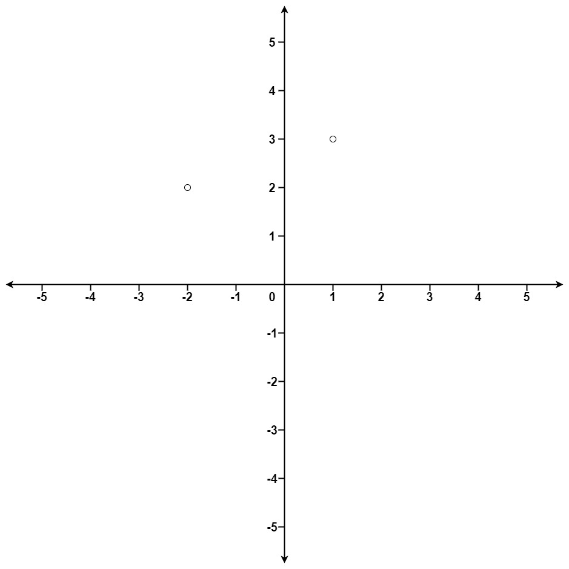

[#0973-k-closest-points-to-origin]
= 973. 最接近原点的 K 个点

https://leetcode.cn/problems/k-closest-points-to-origin/[LeetCode - 973. 最接近原点的 K 个点^]

给定一个数组 `points`，其中 `points[i] = [x~i~, y~i~]` 表示 *X-Y* 平面上的一个点，并且是一个整数 `k`，返回离原点 `(0, 0)` 最近的 `k` 个点。

这里，平面上两点之间的距离是 *欧几里德距离* stem:[\sqrt{(x_2 - x_1)^2 + (y_2 - y_1)^2}]。

你可以按 *任何顺序* 返回答案。除了点坐标的顺序之外，答案 *确保* 是 *唯一* 的。

*示例 1：*

....
输入：points = [[1,3],[-2,2]], k = 1
输出：[[-2,2]]
解释：
(1, 3) 和原点之间的距离为 sqrt(10)，
(-2, 2) 和原点之间的距离为 sqrt(8)，
由于 sqrt(8) < sqrt(10)，(-2, 2) 离原点更近。
我们只需要距离原点最近的 K = 1 个点，所以答案就是 [[-2,2]]。
....

*示例 2：*

....
输入：points = [[3,3],[5,-1],[-2,4]], k = 2
输出：[[3,3],[-2,4]]
（答案 [[-2,4],[3,3]] 也会被接受。）
....

*提示：*

* `1 \<= k \<= points.length \<= 10^4^`
* `-10^4^ < x~i~, y~i~ < 10^4^`

== 思路分析

排序，堆，快速选择等多种解法均可。

WARNING: 快速选择写的还是漏洞百出！！

[[src-0973]]
[tabs]
====
一刷::
+
--
[{java_src_attr}]
----
include::{sourcedir}/_0973_KClosestPointsToOrigin.java[tag=answer]
----
--

// 二刷::
// +
// --
// [{java_src_attr}]
// ----
// include::{sourcedir}/_0973_KClosestPointsToOrigin_2.java[tag=answer]
// ----
// --
====

== 参考资料

. https://leetcode.cn/problems/k-closest-points-to-origin/solutions/478516/kuai-lai-miao-dong-topkkuai-pai-bian-xing-da-gen-d/[973. 最接近原点的 K 个点 - 快来秒懂 TopK！快排变形 & 大根堆^]
. https://leetcode.cn/problems/k-closest-points-to-origin/solutions/477916/zui-jie-jin-yuan-dian-de-k-ge-dian-by-leetcode-sol/[973. 最接近原点的 K 个点 - 官方题解^]

