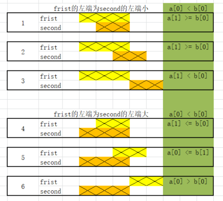

[#0986-interval-list-intersections]
= 986. 区间列表的交集

https://leetcode.cn/problems/interval-list-intersections/[LeetCode - 986. 区间列表的交集 ^]

给定两个由一些 *闭区间* 组成的列表，`firstList` 和 `secondList`，其中 `firstList[i] = [start~i~, end~i~]` 而 `secondList[j] = [start~j~, end~j~]`。每个区间列表都是成对 *不相交* 的，并且 *已经排序* 。

返回这 *两个区间列表的交集* 。

形式上，*闭区间* `[a, b]`（其中 `+a <= b+`）表示实数 `x` 的集合，而 `+a <= x <= b+`。

两个闭区间的 *交集*是一组实数，要么为空集，要么为闭区间。例如，`[1, 3]` 和 `[2, 4]` 的交集为 `[2, 3]` 。

*示例 1：*

image::images/0986-01.png[{image_attr}]

image::images/0056-01.png[{image_attr}]

....
输入：firstList = [[0,2],[5,10],[13,23],[24,25]], secondList = [[1,5],[8,12],[15,24],[25,26]]
输出：[[1,2],[5,5],[8,10],[15,23],[24,24],[25,25]]
....

*示例 2：*

....
输入：firstList = [[1,3],[5,9]], secondList = []
输出：[]
....

*示例 3：*

....
输入：firstList = [], secondList = [[4,8],[10,12]]
输出：[]
....

*示例 4：*

....
输入：firstList = [[1,7]], secondList = [[3,10]]
输出：[[3,7]]
....

*提示：*

* `+0 <= firstList.length, secondList.length <= 1000+`
* `+firstList.length + secondList.length >= 1+`
* `0 \<= start~i~ < end~i~ \<= 10^9^`
* `end~i~ < start~i+1~`
* `0 \<= start~j~ < end~j~ \<= 10^9^`
* `end~j~ < start~j+1~`

== 思路分析

双指针。先排除两种没有交集的情况，剩下四种有交集的情况，左边选两个里面最大的，右边选两个里面最小的。哪个小，向右移动哪个的指针。

官方题解代码更简洁，直接左边选两个里面最大的，右边选两个里面最小的。然后再检查这两个值是否左小右大。也是“哪个小，向右移动哪个的指针。”。

[[src-0986]]
[tabs]
====
一刷::
+
--
[{java_src_attr}]
----
include::{sourcedir}/_0986_IntervalListIntersections.java[tag=answer]
----
--

// 二刷::
// +
// --
// [{java_src_attr}]
// ----
// include::{sourcedir}/_0986_IntervalListIntersections_2.java[tag=answer]
// ----
// --
====

== 参考资料

. https://leetcode.cn/problems/interval-list-intersections/solutions/3604/qu-jian-lie-biao-de-jiao-ji-by-leetcode/[986. 区间列表的交集 - 官方题解^]
. https://leetcode.cn/problems/interval-list-intersections/solutions/1213336/qu-jian-lie-biao-de-jiao-ji-cyu-yan-xian-n901/[986. 区间列表的交集 - 【C语言详解】【超级详细】^]
