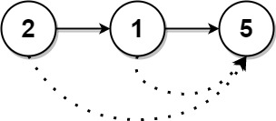
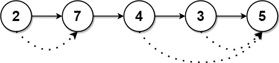
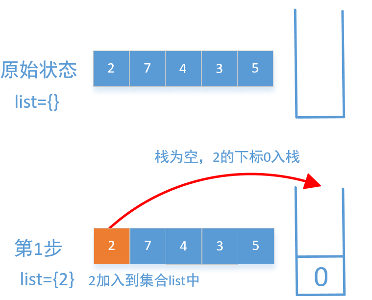
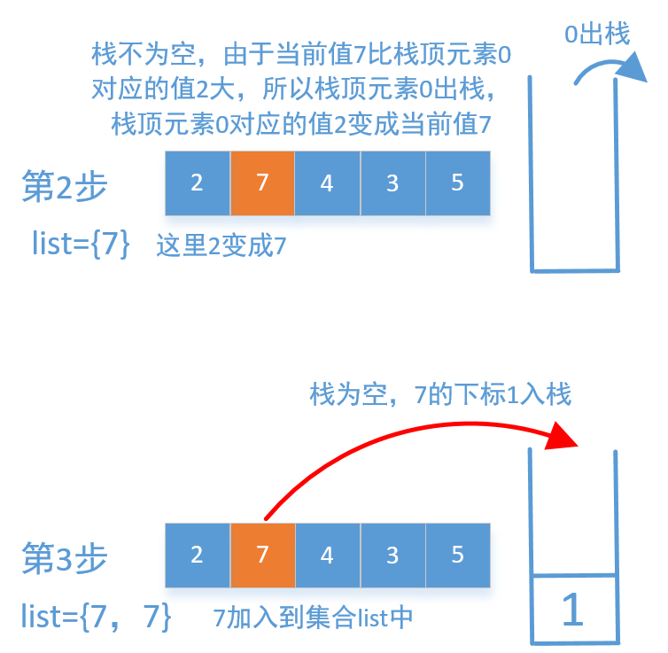
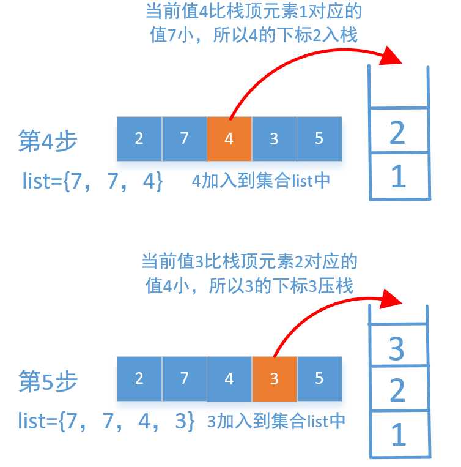
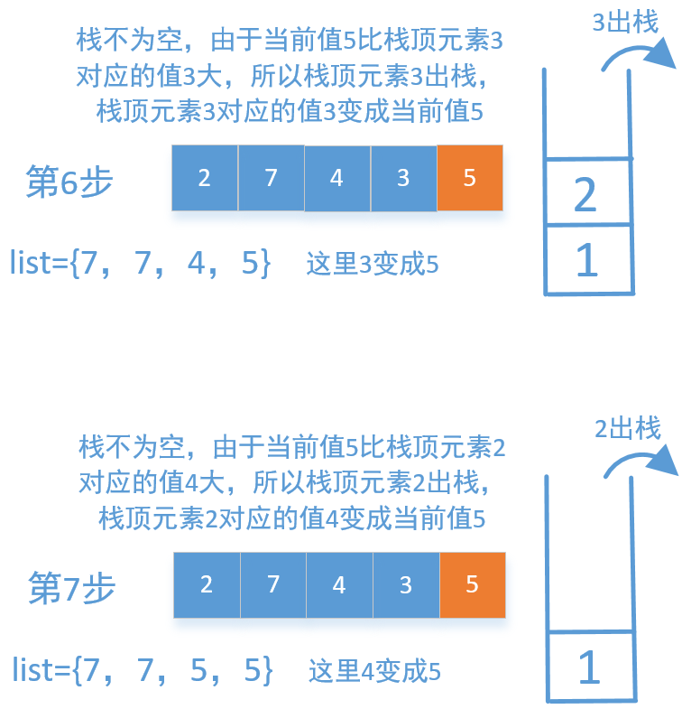
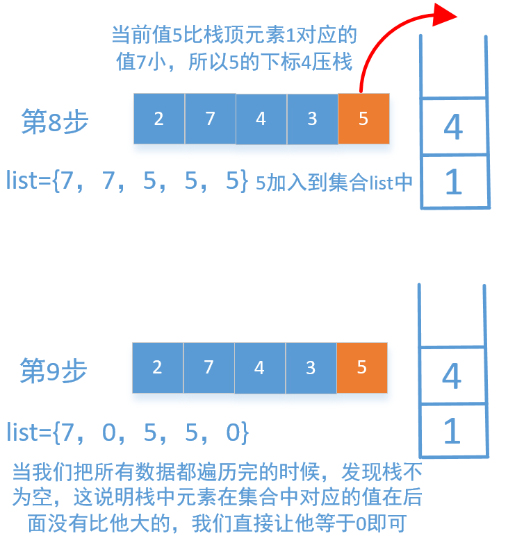

[#1019-next-greater-node-in-linked-list]
= 1019. 链表中的下一个更大节点

https://leetcode.cn/problems/next-greater-node-in-linked-list/[LeetCode - 1019. 链表中的下一个更大节点^]

给定一个长度为 `n` 的链表 `head`。

对于列表中的每个节点，查找下一个 *更大节点* 的值。也就是说，对于每个节点，找到它旁边的第一个节点的值，这个节点的值 *严格大于* 它的值。

返回一个整数数组 `answer`，其中 `answer[i]` 是第 `i` 个节点(*从1开始* )的下一个更大的节点的值。如果第 `i` 个节点没有下一个更大的节点，设置 `answer[i] = 0`。

*示例 1：*

....
输入：head = [2,1,5]
输出：[5,5,0]
....

*示例 2：*

....
输入：head = [2,7,4,3,5]
输出：[7,0,5,5,0]
....

*提示：*

* 链表中节点数为 `n`
* `1 \<= n \<= 10^4^`
* `1 \<= Node.val \<= 10^9^`

== 思路分析

单调栈！

TIP: 这里将链表转成“数组”有点违规。但思路没错。

[[src-1019]]
[tabs]
====
一刷::
+
--
[{java_src_attr}]
----
include::{sourcedir}/_1019_NextGreaterNodeInLinkedList.java[tag=answer]
----
--

// 二刷::
// +
// --
// [{java_src_attr}]
// ----
// include::{sourcedir}/_1019_NextGreaterNodeInLinkedList_2.java[tag=answer]
// ----
// --
====

== 参考资料

. https://leetcode.cn/problems/next-greater-node-in-linked-list/solutions/2217563/tu-jie-dan-diao-zhan-liang-chong-fang-fa-v9ab/[1019. 链表中的下一个更大节点 - 【图解单调栈】两种方法，两张图秒懂！附题单^]
. https://leetcode.cn/problems/next-greater-node-in-linked-list/solutions/442247/5chong-jie-jue-fang-shi-tu-wen-xiang-jie-by-sdwwld/[1019. 链表中的下一个更大节点 - 5种解决方式，图文详解^]
. https://leetcode.cn/problems/next-greater-node-in-linked-list/solutions/2216789/lian-biao-zhong-de-xia-yi-ge-geng-da-jie-u9yo/[1019. 链表中的下一个更大节点 - 官方题解^]
