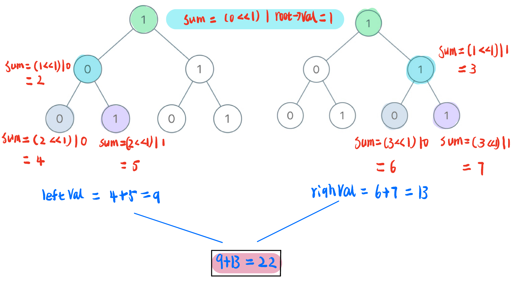

[#1022-sum-of-root-to-leaf-binary-numbers]
= 1022. 从根到叶的二进制数之和

https://leetcode.cn/problems/sum-of-root-to-leaf-binary-numbers/[LeetCode - 1022. 从根到叶的二进制数之和 ^]

给出一棵二叉树，其上每个结点的值都是 `0` 或 `1` 。每一条从根到叶的路径都代表一个从最高有效位开始的二进制数。

* 例如，如果路径为 `0 -> 1 -> 1 -> 0 -> 1`，那么它表示二进制数 `01101`，也就是 `13` 。

对树上的每一片叶子，我们都要找出从根到该叶子的路径所表示的数字。

返回这些数字之和。题目数据保证答案是一个 *32 位* 整数。

*示例 1：*

image::images/1022-01.png[{image_attr}]

....
输入：root = [1,0,1,0,1,0,1]
输出：22
解释：(100) + (101) + (110) + (111) = 4 + 5 + 6 + 7 = 22
....

*示例 2：*

....
输入：root = [0]
输出：0
....

*提示：*

* 树中的节点数在 `[1, 1000]` 范围内
* `Node.val` 仅为 `0` 或 `1`

== 思路分析

深度优先遍历，从 `root` 节点开始计算数值，到叶子节点计算完毕加入到总和中即可。

[[src-1022]]
[tabs]
====
一刷::
+
--
[{java_src_attr}]
----
include::{sourcedir}/_1022_SumOfRootToLeafBinaryNumbers.java[tag=answer]
----
--

// 二刷::
// +
// --
// [{java_src_attr}]
// ----
// include::{sourcedir}/_1022_SumOfRootToLeafBinaryNumbers_2.java[tag=answer]
// ----
// --
====

== 参考资料

. https://leetcode.cn/problems/sum-of-root-to-leaf-binary-numbers/[1022. 从根到叶的二进制数之和 - 官方题解^]
. https://leetcode.cn/problems/sum-of-root-to-leaf-binary-numbers/solutions/1526069/by-ac_oier-1905/[1022. 从根到叶的二进制数之和 - 树的遍历运用题^]
. https://leetcode.cn/problems/sum-of-root-to-leaf-binary-numbers/solutions/1525940/by-nehzil-4gym/[1022. 从根到叶的二进制数之和 - 递归三部曲「图解过程」^]
