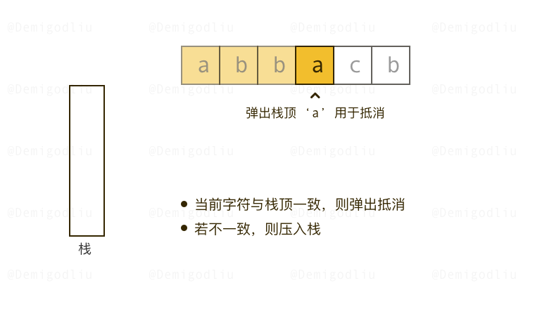

[#1047-remove-all-adjacent-duplicates-in-string]
= 1047. 删除字符串中的所有相邻重复项

https://leetcode.cn/problems/remove-all-adjacent-duplicates-in-string/[LeetCode - 1047. 删除字符串中的所有相邻重复项^]

给出由小写字母组成的字符串 `s`，**重复项删除操作**会选择两个相邻且相同的字母，并删除它们。

在 `s` 上反复执行重复项删除操作，直到无法继续删除。

在完成所有重复项删除操作后返回最终的字符串。答案保证唯一。

*示例：*

....
输入："abbaca"
输出："ca"
解释：
例如，在 "abbaca" 中，我们可以删除 "bb" 由于两字母相邻且相同，这是此时唯一可以执行删除操作的重复项。之后我们得到字符串 "aaca"，其中又只有 "aa" 可以执行重复项删除操作，所以最后的字符串为 "ca"。
....

*提示：*

. `1 \<= s.length \<= 10^5^`
. `s` 仅由小写英文字母组成。

== 思路分析

把 `StringBuilder` 当做栈来使用。将最后一个字符与当前字符比较，相等则删除最后一个字符，否则就添加。

image::images/1047-10.png[{image_attr}]

[[src-1047]]
[tabs]
====
一刷::
+
--
[{java_src_attr}]
----
include::{sourcedir}/_1047_RemoveAllAdjacentDuplicatesInString.java[tag=answer]
----
--

二刷::
+
--
[{java_src_attr}]
----
include::{sourcedir}/_1047_RemoveAllAdjacentDuplicatesInString_2.java[tag=answer]
----
--
====

== 参考资料

. https://leetcode.cn/problems/remove-all-adjacent-duplicates-in-string/solutions/644172/tu-jie-guan-fang-tui-jian-ti-jie-shan-ch-x8iz/[1047. 删除字符串中的所有相邻重复项 - 图解^]
. https://leetcode.cn/problems/remove-all-adjacent-duplicates-in-string/solutions/643955/shan-chu-zi-fu-chuan-zhong-de-suo-you-xi-4ohr/[1047. 删除字符串中的所有相邻重复项 - 官方题解^]
. https://leetcode.cn/problems/remove-all-adjacent-duplicates-in-string/solutions/644365/cong-30-dao-100wu-chong-shi-xian-jie-jue-vkah/[1047. 删除字符串中的所有相邻重复项 - 五种方式^]
