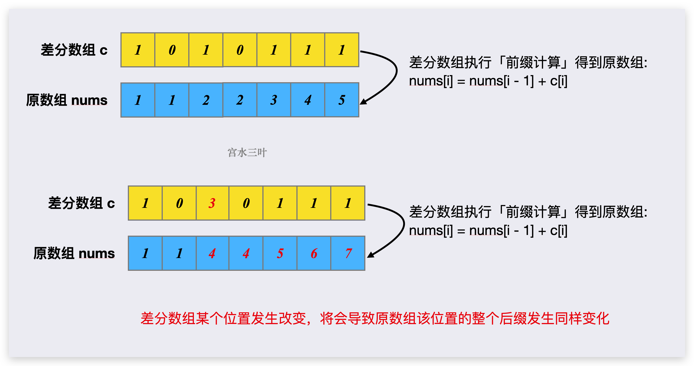

[#1094-car-pooling]
= 1094. Car Pooling

https://leetcode.com/problems/car-pooling/[LeetCode - Car Pooling^]

You are driving a vehicle that has `capacity` empty seats initially available for passengers.  The vehicle *only* drives east (ie. it *cannot* turn around and drive west.)

Given a list of `trips`, `trip[i] = [num_passengers, start_location, end_location]` contains information about the `i`-th trip: the number of passengers that must be picked up, and the locations to pick them up and drop them off.  The locations are given as the number of kilometers due east from your vehicle's initial location.

Return `true` if and only if it is possible to pick up and drop off all passengers for all the given trips. 

*Example 1:*

[subs="verbatim,quotes,macros"]
----
*Input:* trips = [[2,1,5],[3,3,7]], capacity = 4
*Output:* false
----

*Example 2:*

[subs="verbatim,quotes,macros"]
----
*Input:* trips = [[2,1,5],[3,3,7]], capacity = 5
*Output:* true
----

*Example 3:*

[subs="verbatim,quotes,macros"]
----
*Input:* trips = [[2,1,5],[3,5,7]], capacity = 3
*Output:* true
----

*Example 4:*

[subs="verbatim,quotes,macros"]
----
*Input:* trips = [[3,2,7],[3,7,9],[8,3,9]], capacity = 11
*Output:* true
----

*Constraints:*

. `trips.length <= 1000`
. `trips[i].length == 3`
. `1 <= trips[i][0] <= 100`
. `0 <= trips[i][1] < trips[i][2] <= 1000`
. `1 <= capacity <= 100000`

== 思路分析

与 xref:0370-range-addition.adoc[370. Range Addition] 思路一样，都是差分数组。

[[src-1094]]
[{java_src_attr}]
----
include::{sourcedir}/_1094_CarPooling.java[tag=answer]
----

== 参考资料

.https://leetcode.cn/problems/car-pooling/solutions/2546591/pin-che-by-leetcode-solution-scp6/[1094. 拼车 - 官方题解^]
. https://leetcode.cn/problems/car-pooling/solutions/2550264/suan-fa-xiao-ke-tang-chai-fen-shu-zu-fu-9d4ra/[1094. 拼车 - 差分数组（附题单）^]
. https://leetcode.cn/problems/car-pooling/solutions/2550276/gong-shui-san-xie-tu-jie-chai-fen-ru-men-opii/[1094. 拼车 - 【宫水三叶】图解「差分」入门（"前缀和" 到 "差分" 丝滑过渡）^]
. https://leetcode.cn/problems/car-pooling/solutions/2550518/javapython3cmo-ni-shu-zu-tong-ji-shang-x-lb0z/[1094. 拼车 - 模拟 + 数组：统计上下客乘客数变化【图解】^]

