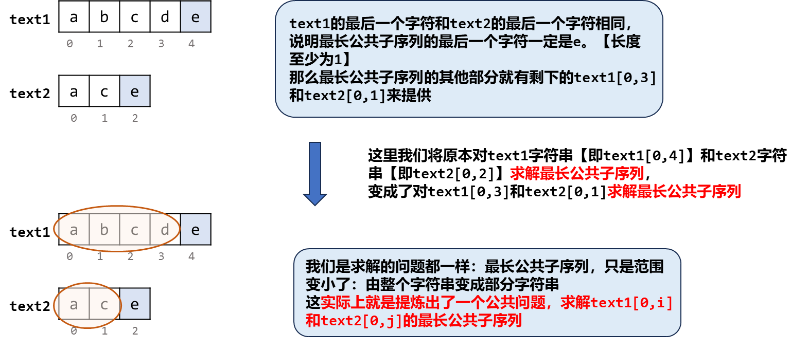
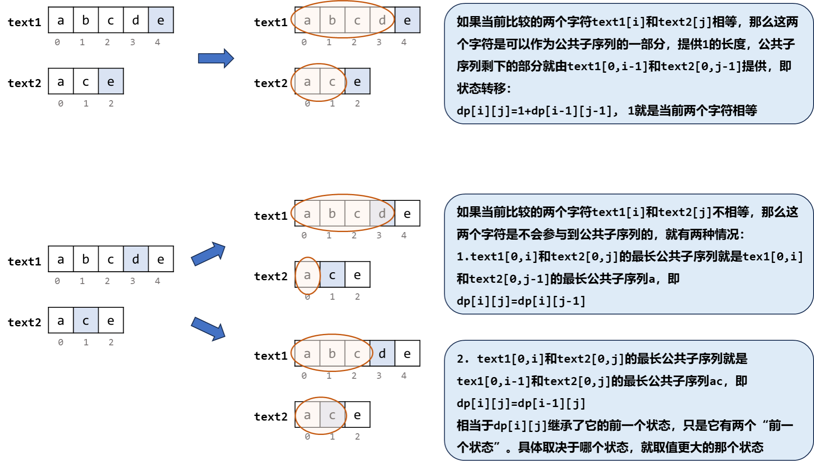
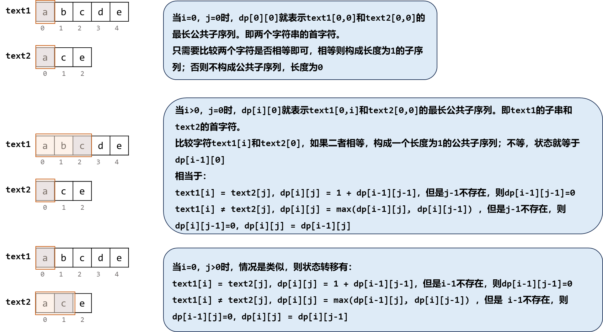
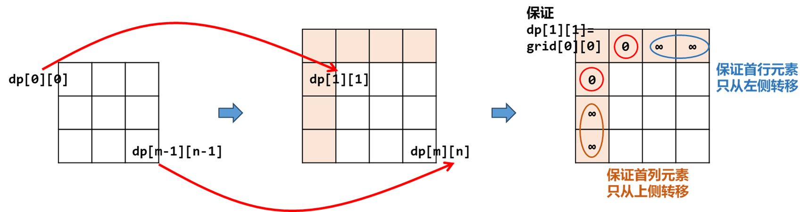
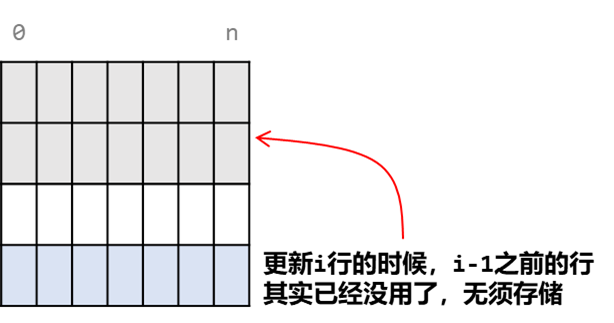
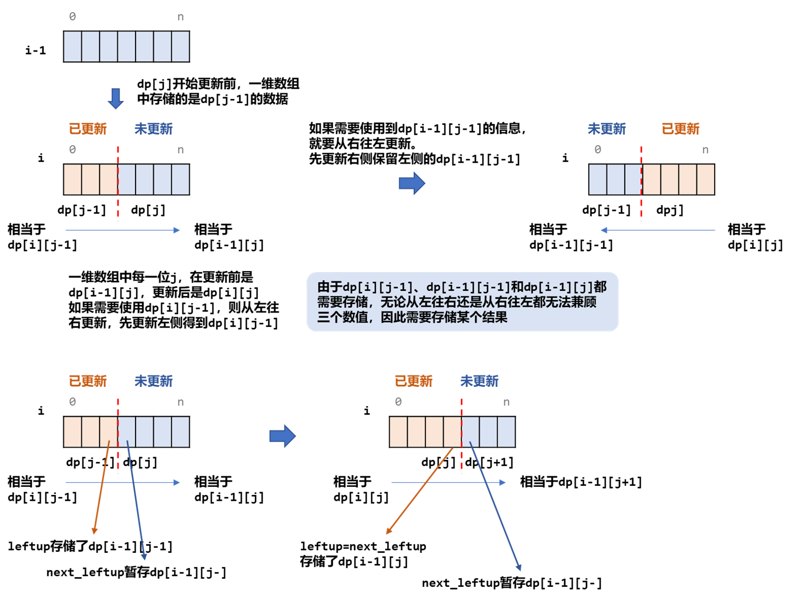

[#1143-longest-common-subsequence]
= 1143. 最长公共子序列

https://leetcode.cn/problems/longest-common-subsequence/[LeetCode - 1143. 最长公共子序列 ^]

给定两个字符串 `text1` 和 `text2`，返回这两个字符串的最长 *公共子序列* 的长度。如果不存在 *公共子序列* ，返回 `0` 。

一个字符串的 *子序列* 是指这样一个新的字符串：它是由原字符串在不改变字符的相对顺序的情况下删除某些字符（也可以不删除任何字符）后组成的新字符串。

* 例如，`"ace"` 是 `"abcde"` 的子序列，但 `"aec"` 不是 `"abcde"` 的子序列。

两个字符串的 *公共子序列* 是这两个字符串所共同拥有的子序列。

*示例 1：*

....
输入：text1 = "abcde", text2 = "ace"
输出：3
解释：最长公共子序列是 "ace" ，它的长度为 3 。
....

*示例 2：*

....
输入：text1 = "abc", text2 = "abc"
输出：3
解释：最长公共子序列是 "abc" ，它的长度为 3 。
....

*示例 3：*

....
输入：text1 = "abc", text2 = "def"
输出：0
解释：两个字符串没有公共子序列，返回 0 。
....

*提示：*

* `+1 <= text1.length, text2.length <= 1000+`
* `text1` 和 `text2` 仅由小写英文字符组成。

== 思路分析

递归公式大概如下：

image::images/1143-16.png[{image_attr}]

这个解法也可以用来解决 xref:0300-longest-increasing-subsequence.adoc[300. 最长递增子序列]。

[[src-1143]]
[tabs]
====
一刷::
+
--
[{java_src_attr}]
----
include::{sourcedir}/_1143_LongestCommonSubsequence.java[tag=answer]
----
--

二刷::
+
--
[{java_src_attr}]
----
include::{sourcedir}/_1143_LongestCommonSubsequence_2.java[tag=answer]
----
--
====

== 参考资料

. https://leetcode.cn/problems/longest-common-subsequence/solutions/696763/zui-chang-gong-gong-zi-xu-lie-by-leetcod-y7u0/[1143. 最长公共子序列 - 官方题解^]
. https://leetcode.cn/problems/longest-common-subsequence/solutions/2133188/jiao-ni-yi-bu-bu-si-kao-dong-tai-gui-hua-lbz5/[1143. 最长公共子序列 - 教你一步步思考动态规划：从记忆化搜索到递推^] -- 一步一步前进，讲解细致
. https://leetcode.cn/problems/longest-common-subsequence/solutions/2876976/javapython3cdong-tai-gui-hua-gou-jian-zu-sq3e/[1143. 最长公共子序列 - 动态规划：构建最长公共子序列的子问题【图解】^]
. https://leetcode.cn/problems/longest-common-subsequence/solutions/696989/fu-xue-ming-zhu-er-wei-dong-tai-gui-hua-r5ez6/[1143. 最长公共子序列 - 二维动态规划的常规套路^]
. https://leetcode.cn/problems/longest-common-subsequence/solutions/67460/dong-tai-gui-hua-zhi-zui-chang-gong-gong-zi-xu-lie/[1143. 最长公共子序列 - 动态规划之最长公共子序列（LCS）^]
