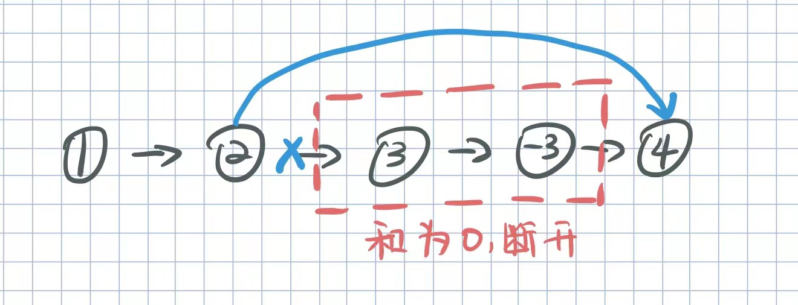
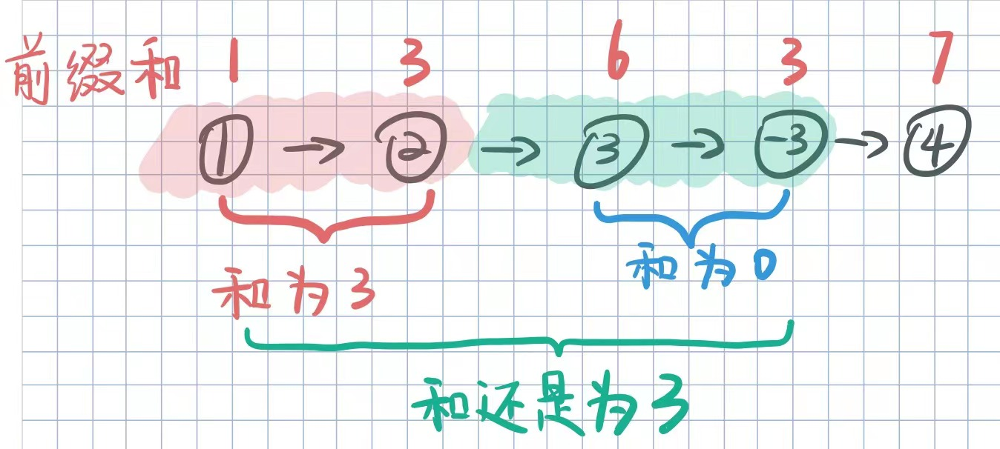
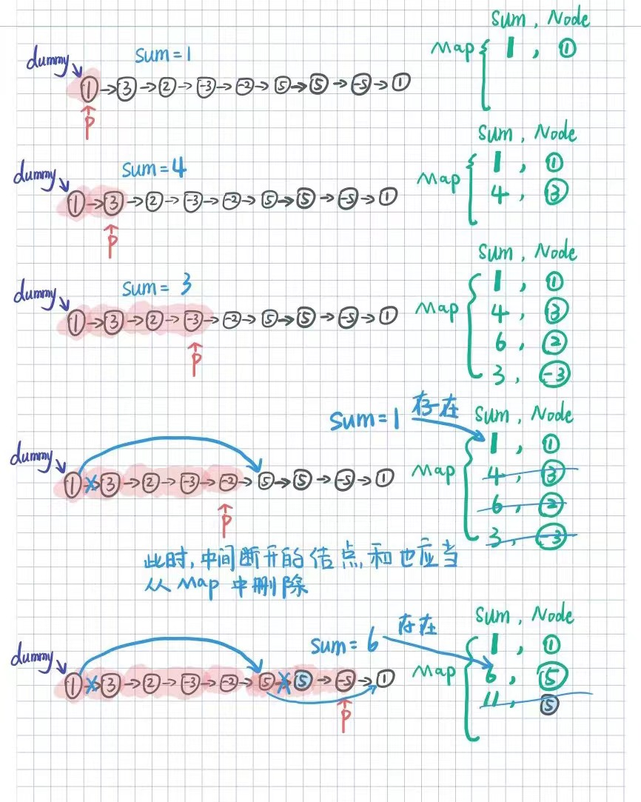
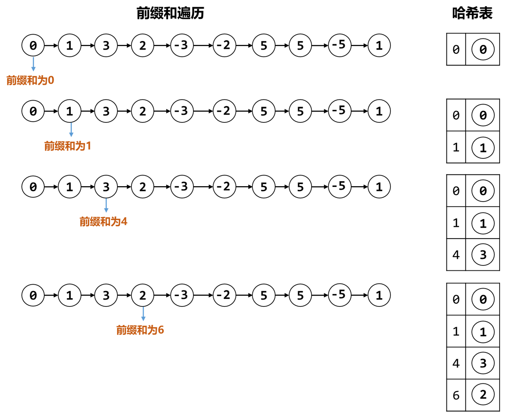

[#1171-remove-zero-sum-consecutive-nodes-from-linked-list]
= 1171. 从链表中删去总和值为零的连续节点

https://leetcode.cn/problems/remove-zero-sum-consecutive-nodes-from-linked-list/[LeetCode - 1171. 从链表中删去总和值为零的连续节点 ^]

给你一个链表的头节点 `head`，请你编写代码，反复删去链表中由 *总和* 值为 `0` 的连续节点组成的序列，直到不存在这样的序列为止。

删除完毕后，请你返回最终结果链表的头节点。

你可以返回任何满足题目要求的答案。

（注意，下面示例中的所有序列，都是对 `ListNode` 对象序列化的表示。）

*示例 1：*

....
输入：head = [1,2,-3,3,1]
输出：[3,1]
提示：答案 [1,2,1] 也是正确的。
....

*示例 2：*

....
输入：head = [1,2,3,-3,4]
输出：[1,2,4]
....

*示例 3：*

....
输入：head = [1,2,3,-3,-2]
输出：[1]
....

*提示：*

* 给你的链表中可能有 `1` 到 `1000` 个节点。
* 对于链表中的每个节点，节点的值：`+-1000 <= node.val <= 1000+`.

== 思路分析

想到了前缀和，但是没想到可以利用中间和为 `0`，直接跳过这部分节点。

[[src-1171]]
[tabs]
====
一刷::
+
--
[{java_src_attr}]
----
include::{sourcedir}/_1171_RemoveZeroSumConsecutiveNodesFromLinkedList.java[tag=answer]
----
--

// 二刷::
// +
// --
// [{java_src_attr}]
// ----
// include::{sourcedir}/_1171_RemoveZeroSumConsecutiveNodesFromLinkedList_2.java[tag=answer]
// ----
// --
====

== 参考资料

. https://leetcode.cn/problems/remove-zero-sum-consecutive-nodes-from-linked-list/solutions/1142176/qian-zhui-he-dan-lian-biao-de-qian-zhui-kwr05/[1171. 从链表中删去总和值为零的连续节点 - 【前缀和】单链表的前缀和超详细解法^]
. https://leetcode.cn/problems/remove-zero-sum-consecutive-nodes-from-linked-list/solutions/2305659/javapython3qian-zhui-he-ha-xi-biao-yi-ci-6nya/[1171. 从链表中删去总和值为零的连续节点 - 前缀和 + 哈希表（一次遍历）【图解】^]
. https://leetcode.cn/problems/remove-zero-sum-consecutive-nodes-from-linked-list/solutions/2297308/cong-lian-biao-zhong-shan-qu-zong-he-zhi-h18o/[1171. 从链表中删去总和值为零的连续节点 - 官方题解^]

