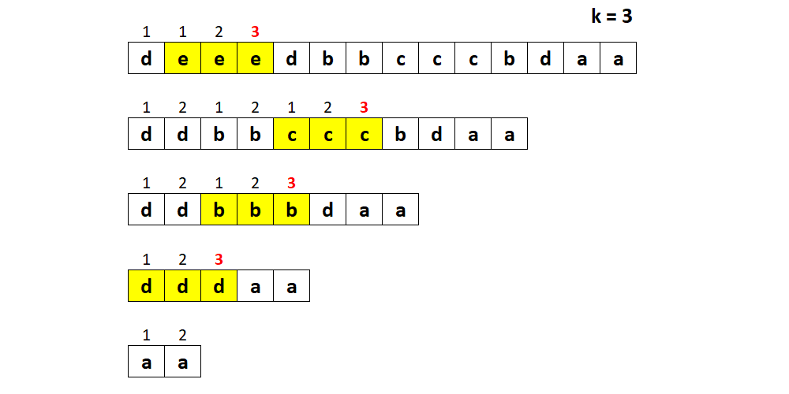
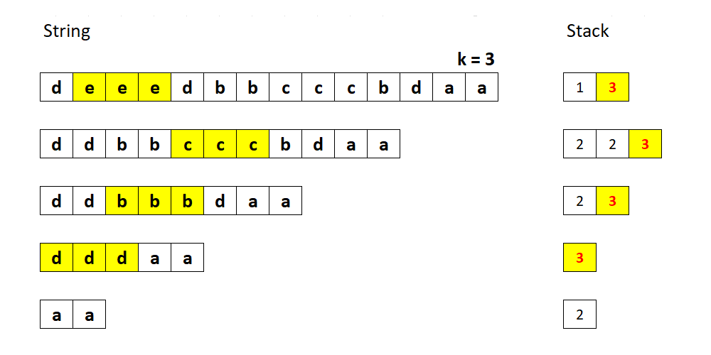
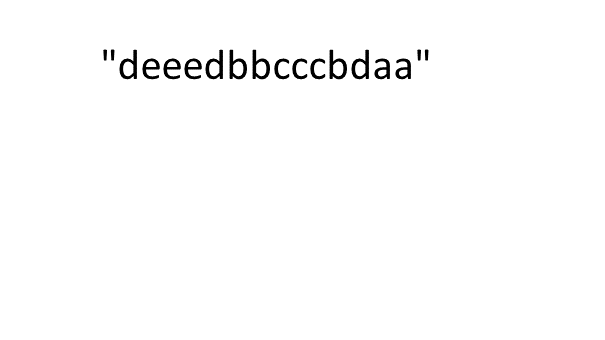

[#1209-remove-all-adjacent-duplicates-in-string-ii]
= 1209. 删除字符串中的所有相邻重复项 II

https://leetcode.cn/problems/remove-all-adjacent-duplicates-in-string-ii/[LeetCode - 1209. 删除字符串中的所有相邻重复项 II ^]

给你一个字符串 `s`，「`k` 倍重复项删除操作」将会从 `s` 中选择 `k` 个相邻且相等的字母，并删除它们，使被删去的字符串的左侧和右侧连在一起。

你需要对 `s` 重复进行无限次这样的删除操作，直到无法继续为止。

在执行完所有删除操作后，返回最终得到的字符串。

本题答案保证唯一。

*示例 1：*

....
输入：s = "abcd", k = 2
输出："abcd"
解释：没有要删除的内容。
....

*示例 2：*

....
输入：s = "deeedbbcccbdaa", k = 3
输出："aa"
解释：
先删除 "eee" 和 "ccc"，得到 "ddbbbdaa"
再删除 "bbb"，得到 "dddaa"
最后删除 "ddd"，得到 "aa"
....

*示例 3：*

....
输入：s = "pbbcggttciiippooaais", k = 2
输出："ps"
....

*提示：*

* `1 \<= s.length \<= 10^5^`
* `2 \<= k \<= 10^4^`
* `s` 中只含有小写英文字母。

== 思路分析

最初的想法是暴力解法：对重复的相邻字母计数，当计数达到 k 时将其删除。重复此操作，直到没有删除的字符为止。通过 19 / 21 个测试用例。

暴力解法最大的问题就是字符次数的重复计算，可以开辟一个数组，记录每个下标对应的出现次数，这样直接在上一个基础上+1或从1开始计数即可。

也可以用栈！不过，在没有重复字符的情况下，空间复杂度相比用数组更消耗空间。

[[src-1209]]
[tabs]
====
一刷::
+
--
[{java_src_attr}]
----
include::{sourcedir}/_1209_RemoveAllAdjacentDuplicatesInStringIi.java[tag=answer]
----
--

// 二刷::
// +
// --
// [{java_src_attr}]
// ----
// include::{sourcedir}/_1209_RemoveAllAdjacentDuplicatesInStringIi_2.java[tag=answer]
// ----
// --
====

== 参考资料

. https://leetcode.cn/problems/remove-all-adjacent-duplicates-in-string-ii/solutions/99459/shan-chu-zi-fu-chuan-zhong-de-suo-you-xiang-lin--4/[1209. 删除字符串中的所有相邻重复项 II - 官方题解^] -- 多种解法，值得学习！
