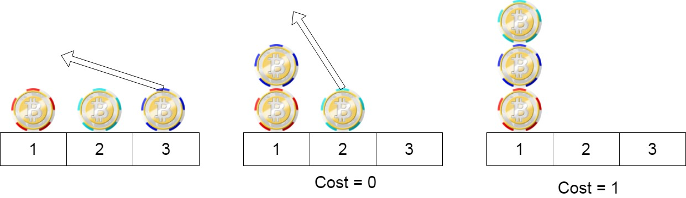

[#1217-minimum-cost-to-move-chips-to-the-same-position]
= 1217. 玩筹码

https://leetcode.cn/problems/minimum-cost-to-move-chips-to-the-same-position/[LeetCode - 1217. 玩筹码^]

有 `n` 个筹码。第 `i` 个筹码的位置是 `position[i]` 。

我们需要把所有筹码移到同一个位置。在一步中，我们可以将第 `i` 个筹码的位置从 `position[i]` 改变为:

* `position[i] + 2` 或 `position[i] - 2` ，此时 `cost = 0`
* `position[i] + 1` 或 `position[i] - 1` ，此时 `cost = 1`

返回将所有筹码移动到同一位置上所需要的 _最小代价_ 。

*示例 1：*

....
输入：position = [1,2,3]
输出：1
解释：第一步:将位置3的筹码移动到位置1，成本为0。
第二步:将位置2的筹码移动到位置1，成本= 1。
总成本是1。
....

*示例 2：*

image::images/1217-02.jpg[{image_attr}]

....
输入：position = [2,2,2,3,3]
输出：2
解释：我们可以把位置3的两个筹码移到位置2。每一步的成本为1。总成本= 2。
....

*示例 3:*

....
输入：position = [1,1000000000]
输出：1
....

*提示：*

* `+1 <= position.length <= 100+`
* `1 \<= position[i] \<= 10^9^`

== 思路分析

注意：`position[i]` 中的数字是筹码的位置，而不是下标。所以，不能从下标的位置来计算。由于位置移动 `+2` 或 `-2` 不收费，相当于从奇数到奇数和从偶数到偶数时不收费。那么就统计一下奇数和偶数的数量，紧挨的移动需要付费，那么就看奇数和偶数哪个数字小，就移动哪个。

[[src-1217]]
[tabs]
====
一刷::
+
--
[{java_src_attr}]
----
include::{sourcedir}/_1217_MinimumCostToMoveChipsToTheSamePosition.java[tag=answer]
----
--

二刷::
+
--
[{java_src_attr}]
----
include::{sourcedir}/_1217_MinimumCostToMoveChipsToTheSamePosition_2.java[tag=answer]
----
--
====

== 参考资料

. https://leetcode.cn/problems/minimum-cost-to-move-chips-to-the-same-position/solutions/1651725/wan-chou-ma-by-leetcode-solution-swnp/[1217. 玩筹码 - 官方题解^]
. https://leetcode.cn/problems/minimum-cost-to-move-chips-to-the-same-position/solutions/277716/xian-li-jie-ti-yi-zai-li-jie-dai-ma-si-lu-by-athen/[1217. 玩筹码 - 先理解题意，再理解代码思路^]
. https://leetcode.cn/problems/minimum-cost-to-move-chips-to-the-same-position/solutions/478371/yong-tan-xin-si-xiang-lai-zhao-gui-lu-chao-xiang-x/[1217. 玩筹码 - 用贪心思想来找规律（超详细，含证明）^]
