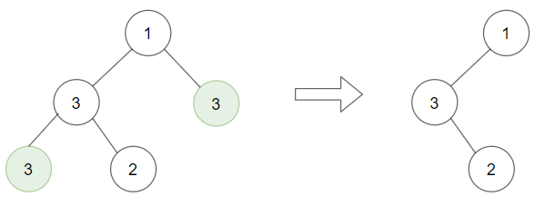

[#1325-delete-leaves-with-a-given-value]
= 1325. 删除给定值的叶子节点

https://leetcode.cn/problems/delete-leaves-with-a-given-value/[LeetCode - 1325. 删除给定值的叶子节点 ^]

给你一棵以 `root` 为根的二叉树和一个整数 `target` ，请你删除所有值为 `target` 的 *叶子节点* 。

注意，一旦删除值为 `target` 的叶子节点，它的父节点就可能变成叶子节点；如果新叶子节点的值恰好也是 `target`，那么这个节点也应该被删除。

也就是说，你需要重复此过程直到不能继续删除。

*示例 1：*

....
输入：root = [1,2,3,2,null,2,4], target = 2
输出：[1,null,3,null,4]
解释：
上面左边的图中，绿色节点为叶子节点，且它们的值与 target 相同（同为 2 ），它们会被删除，得到中间的图。
有一个新的节点变成了叶子节点且它的值与 target 相同，所以将再次进行删除，从而得到最右边的图。
....

*示例 2：*

....
输入：root = [1,3,3,3,2], target = 3
输出：[1,3,null,null,2]
....

*示例 3：*

....
输入：root = [1,2,null,2,null,2], target = 2
输出：[1]
解释：每一步都删除一个绿色的叶子节点（值为 2）。
....

*提示：*

* 树中节点数量的范围是 `[1, 3000]`。
* `+1 <= Node.val, target <= 1000+`

== 思路分析

深度优先遍历，而且做“后序”处理：在获取返回值后，对当前节点再做判断，这样就可以链式地删除掉符合条件的节点。

[[src-1325]]
[tabs]
====
一刷::
+
--
[{java_src_attr}]
----
include::{sourcedir}/_1325_DeleteLeavesWithAGivenValue.java[tag=answer]
----
--

// 二刷::
// +
// --
// [{java_src_attr}]
// ----
// include::{sourcedir}/_1325_DeleteLeavesWithAGivenValue_2.java[tag=answer]
// ----
// --
====

== 参考资料

. https://leetcode.cn/problems/delete-leaves-with-a-given-value/solutions/101264/shan-chu-gei-ding-zhi-de-xie-zi-jie-dian-by-leet-2/[1325. 删除给定值的叶子节点 - 官方题解^]
. https://leetcode.cn/problems/delete-leaves-with-a-given-value/solutions/423926/java-shu-de-hou-xu-bian-li-xiang-guan-wen-ti-by-sa/[1325. 删除给定值的叶子节点 - Java 树的后续遍历相关问题^]
